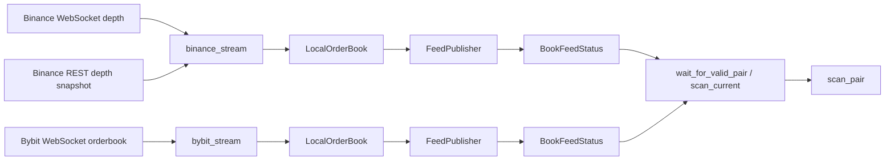
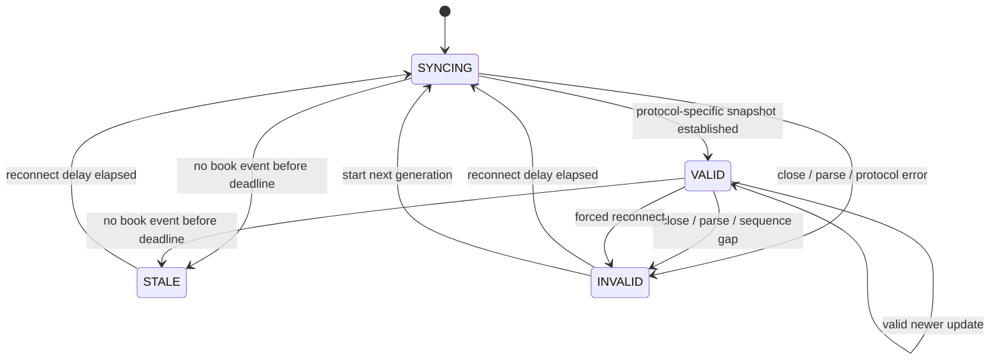

# A-03 WebSocket 本地订单簿：设计文档

## 1. 设计目标

以每个交易所一个独立行情任务维护本地订单簿，通过统一 `BookFeed` 只发布当前连接代次的有效快照。场所协议错误在适配器内处理；扫描层只依赖统一状态，不理解 Binance/Bybit 序列细节。

## 2. 模块边界与调用链



职责：

- `crates/core/src/venues/binance_stream.rs`：WebSocket 缓冲、REST 快照衔接、`U/u` 连续性、重连循环。
- `crates/core/src/venues/bybit_stream.rs`：订阅、snapshot/delta、跨序列 `seq`、heartbeat 和重连循环。
- `crates/core/src/local_book.rs::LocalOrderBook`：场所无关的绝对档位更新、排序和快照校验。
- `crates/core/src/local_book.rs::{FeedPublisher,BookFeedStatus,BookFeed}`：统一状态发布、消费者订阅和主动重连命令。
- `crates/core/src/observer.rs::{wait_for_valid_pair,scan_current}` 与 `crates/observer-cli/src/main.rs::run_reconnect_smoke`：双所启动门禁、恢复烟测和扫描入口。
- `crates/core/src/scan.rs`：消费已验证快照并继续执行年龄、双所接收偏差和经济准入；不负责流同步。

## 3. 并发与所有权

每个场所 `subscribe` 创建：

1. 一个持有 `FeedPublisher` 和本地簿的 Tokio 后台任务；
2. 一个 `watch` 通道，向消费者发布最新 `BookFeedStatus`；
3. 一个容量为 1 的 `mpsc` 命令通道，仅用于请求主动重连。

本地簿只由对应后台任务写入，不共享可变订单簿。消费者取得的是状态克隆和 `Arc<OrderBookSnapshot>`；不会跨任务修改档位。`watch` 只保留最新状态，符合扫描只关心当前有效视图的需求。

## 4. 统一状态机



实际发布顺序由重连循环保证：每次连接尝试前调用 `syncing(reconnect)`；连接函数返回后发布 `STALE` 或 `INVALID`；延迟后进入下一代次。`syncing`、`stale`、`invalid` 均清空快照，只有 `valid` 设置快照。

不变量：

- `state == VALID` 当且仅当 `snapshot.is_some()`；
- 进入任何新 generation 时旧快照已撤下；
- `generation` 每次连接尝试递增；
- `reconnects` 不计首次连接，只计后续连接尝试；
- `applied_updates` 只在发布有效快照时增加。

## 5. 本地订单簿表示

`LocalOrderBook` 使用两个 `BTreeMap<Decimal, Decimal>`：

- bids 以价格为键，对外反向遍历得到高到低；
- asks 正向遍历得到低到高；
- 更新数量为 0 时删除档位，否则替换该档绝对数量；
- `Decimal` 避免二进制浮点造成价格键和数量计算误差；
- 每次应用后保存场所序列、源时间和本机接收时间；
- 对外仅复制配置深度内的档位，并调用 `OrderBookSnapshot::validate`。

这是唯一订单簿实现。两所适配器只负责把场所消息转换成 `LevelUpdate` 和正确序列。

## 6. Binance 同步算法

1. 连接小写 symbol 的 `<symbol>@depth@100ms` 流。
2. 至少收到一条深度事件后启动 REST 深度快照请求；请求期间继续缓冲事件。
3. 快照返回后继续接收，直到缓冲尾事件的 `u > lastUpdateId`。
4. 删除所有 `u <= lastUpdateId` 的事件。
5. 第一条剩余事件必须覆盖 `lastUpdateId + 1`，即 `U <= expected <= u`。
6. 从快照建立 `LocalOrderBook`，顺序应用所有剩余缓冲事件；任何 `U > local + 1` 都使衔接失败。
7. 发布首个 `VALID` 快照。
8. 实时循环中忽略 `u <= local` 的旧事件；发现 `U > local + 1` 立即退出当前连接函数，由外层发布 `INVALID` 并重建。

设计选择：不尝试用后续事件填补已发现断档，因为丢失范围和簿完整性不可证明。

## 7. Bybit 同步算法

1. 连接公共 spot WebSocket，订阅 `orderbook.<depth>.<symbol>`。
2. 每 20 秒发送应用层 ping；独立静默计时器只由订单簿 snapshot/delta 重置。
3. 控制消息失败、topic/symbol 不符或消息结构错误均结束当前代次。
4. 第一条可应用订单簿消息必须是 snapshot；它完整替换本地簿。
5. 同一代次只接受严格递增的 `seq`；旧或重复 `seq` 直接忽略。
6. delta 按绝对数量应用，以 `u` 作为订单簿序列；源时间优先 `cts`，否则 `ts`。
7. 后续 snapshot 仍完整替换本地簿，可用于交易所服务重启后的重置。

设计选择：跨连接不比较旧代次的 `u/seq`。重连后交易所可能从较小更新 ID 提供新 snapshot；generation 隔离比数值跨代次单调更可靠。

## 8. 静默、错误与恢复

| 条件 | 适配器结果 | 对外状态 | 恢复 |
|---|---|---|---|
| 静默超过 `max_snapshot_age_ms` | `StaleFeed` | `STALE`，无快照 | 等待 `reconnect_delay_ms` 后新代次 |
| 正常 close/EOF | 连接函数结束 | `INVALID`，无快照 | 新代次 |
| 解析、topic/symbol、协议错误 | `Err` | `INVALID`，含脱敏原因 | 新代次 |
| Binance 断档 | `Err` | `INVALID` | 新 WebSocket + 新 REST 快照 |
| Bybit delta 先到 | `Err` | `INVALID` | 重新订阅等待 snapshot |
| 主动重连 | 连接函数收到命令并退出 | `INVALID` | 不等待额外命令，进入更高 generation |

扫描层有第二道门禁：即使状态为 `VALID`，仍检查 `max_snapshot_age_ms` 和 `max_pair_skew_ms`。流静默状态防止继续发布；扫描新鲜度防止两个独立有效流组合成时间差过大的假机会。

## 9. 启动与 CLI 契约

- `wait_for_valid_pair` 在 `stream_start_timeout_ms` 内等待双方均为 `VALID`；超时失败。
- `--once` 使用双方当前有效簿执行一次双向扫描并退出。
- `--reconnect-smoke` 记录两所当前 generation，同时发送主动重连命令；只有两所 generation 均增加且恢复 `VALID` 才输出 `RECONNECT_OK`。
- 持续模式按 `poll_interval_ms` 读取最新状态；任一非 `VALID` 时跳过扫描。
- A-03 路径不创建订单客户端，不接受交易参数，不调用私有接口。

## 10. 配置契约

A-03 使用现有 `config/observer.toml` 字段：

```toml
stream_start_timeout_ms = 10000
reconnect_delay_ms = 1000
max_snapshot_age_ms = 1000
max_pair_skew_ms = 500
orderbook_depth = 50

[binance]
base_url = "https://api.binance.com"
websocket_url = "wss://stream.binance.com:9443"

[bybit]
base_url = "https://api.bybit.com"
websocket_url = "wss://stream.bybit.com/v5/public/spot"
```

共享深度只允许 50、200、1000，确保两所公共流都支持同一配置。生产 URL 必须使用 HTTPS/WSS；仅测试夹具允许 localhost HTTP/WS。

## 11. 验收场景到实现映射

| 需求 | 场景 | 主要符号 | 发布证据 |
|---|---|---|---|
| A03-R01 | Binance 快照后继覆盖 | `bridge_snapshot` | `bridge_accepts_event_covering_snapshot_successor` |
| A03-R02 | Binance 首事件断档 | `bridge_snapshot` | `bridge_rejects_sequence_gap` |
| A03-R01、A03-R03 | 绝对档位插入/替换/删除 | `LocalOrderBook::apply` | `absolute_updates_replace_insert_and_delete_levels` |
| A03-R04 | 非有效状态撤下快照 | `FeedPublisher` | `non_valid_states_remove_last_snapshot` |
| A03-R04、A03-R05 | 重连代次隔离 | `FeedPublisher::syncing` | `reconnect_generation_clears_snapshot` |
| A03-R03 | Bybit 源时间和更新 ID | `snapshot_from_event` | `snapshot_uses_matching_engine_time_and_update_id` |
| A03-R03 | Bybit 重启 snapshot | `run_connection` | `restart_snapshot_can_replace_higher_update_id` |
| A03-R03 | Bybit 旧跨序列 | `advances_cross_sequence` | `stale_cross_sequence_is_rejected` |
| A03-R06、A03-R07 | 双所真实启动 | `wait_for_valid_pair`、`--once` | 发布时真实 BTCUSDT 双向扫描 |
| A03-R05 | 双所主动恢复 | `run_reconnect_smoke` | generation 1→2、两所 `reconnects=1`、恢复 `VALID` |

## 12. 协议来源

- Binance Spot WebSocket Streams：`https://developers.binance.com/en/docs/products/spot/web-socket-streams`
- Binance Spot REST Market Data：`https://developers.binance.com/en/docs/products/spot/rest-api/market-data-endpoints`
- Bybit V5 WebSocket Orderbook：`https://bybit-exchange.github.io/docs/v5/websocket/public/orderbook`

能力与限制以运行时协议和官方文档为准；适配器不能用跨交易所统一假设覆盖场所序列语义。

## 13. 已知边界

- 发布烟测只覆盖一次真实启动和一次人工重连，不证明长运行稳定性。
- `watch` 合并中间状态，适合当前状态消费，不是完整事件审计；A-05 另行记录观察证据。
- Bybit 对不递增 `seq` 采取忽略；若官方协议改变为要求强连续断档检测，必须重新设计和验收。
- Binance REST 快照只覆盖有限深度；本系统仅对配置可见深度和后续收到更新的档位负责。
