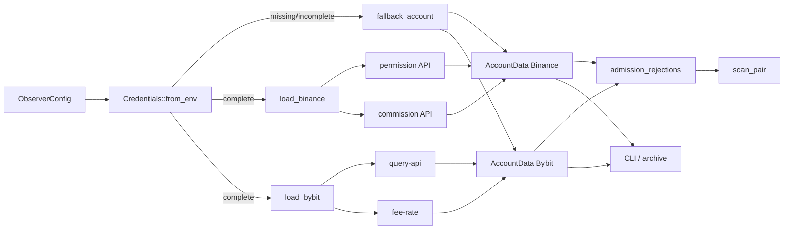

# A-04 账户能力与实际费率：设计文档

## 1. 设计目标

将“场所文档能力”“当前 API key 权限”“当前 symbol 实际账户费率”合并成每所一个 `AccountData`，供 CLI 展示、扫描门禁和 A-05 决策归档共同使用。私有接口故障不得中断公共观察，但必须撤销经济准入。

## 2. 模块与数据流



主要职责：

- `crates/core/src/config.rs`：环境变量名、HTTP/认证窗口、刷新间隔、最大费率年龄与人工资格确认的配置校验。
- `crates/core/src/account.rs::capability`：静态能力卡和官方来源。
- `crates/core/src/account.rs::Credentials`：秘密注入和 `Zeroizing` 生命周期。
- `crates/core/src/account.rs::load_account_data`：两所并发加载、错误隔离和回退。
- `crates/core/src/account.rs::{load_binance,load_bybit}`：场所权限与费率组合。
- `crates/core/src/account.rs::{binance_get,bybit_get}`：认证、HTTP 状态和场所错误归一化。
- `crates/core/src/account.rs::AccountData::admission_rejections`：动态费率有效性门禁。
- `crates/core/src/account.rs` 与 `crates/core/src/observer.rs`：持续刷新、独立账户检查和安全输出；桌面 `account_status` 命令承载检查入口。
- `crates/core/src/scan.rs`：合并账户拒绝原因并将实际买卖侧费率映射到两个套利方向。

## 3. 核心数据模型

```text
AccountData
├── venue
├── CapabilityCard
│   ├── region_eligible_confirmed
│   ├── account_eligible_confirmed
│   ├── order_recovery / rate_limits / client_order_id
│   ├── ioc_fok / fee_currency / history_window
│   └── sources[]
├── PermissionAssessment
│   ├── configured
│   ├── read_only: Option<bool>
│   ├── ip_restricted: Option<bool>
│   └── scopes[]
├── FeeSchedule
│   ├── symbol
│   ├── buy_taker_rate / sell_taker_rate
│   ├── source
│   ├── loaded_at_ms / expires_at_ms
│   └── actual_account_rate
└── rejection_reasons[]
```

`AccountData` 不包含 credentials，因此其 `Serialize` 实现可安全用于 CLI 和归档。拒绝原因分两类：加载时固定原因保存在 `rejection_reasons`；随当前时间变化的“非实际费率/费率已过期”由 `admission_rejections(now_ms)` 动态追加。

## 4. 初始化和刷新流程

`load_account_data` 使用 `tokio::join!` 并发调用两所 `load_venue`：

1. 建立对应静态能力卡。
2. 加载该场所环境变量凭证。
3. 凭证缺失/不完整时直接构造回退账户数据，不发私有请求。
4. 完整凭证进入场所适配器，并发或顺序完成权限、费率接口调用。
5. 任一适配器返回错误，由 `load_venue` 转成回退账户数据并保留归一化错误原因；不向顶层抛出导致公共观察退出。
6. 资格未确认、权限非只读等规则追加到该场所拒绝原因。
7. 返回固定顺序 `[Binance, Bybit]`。

启动时所有 CLI 模式先加载一次。持续观察另建 `account_ticker`，按 `account_refresh_interval_ms` 重新构造整个数组。刷新失败不会沿用旧成功对象：新的失败对象使用回退费率并拒绝准入。

## 5. 凭证边界

`Credentials` 内部字段为 `Zeroizing<String>`，只有 `account.rs` 的认证函数可借用。关键不变量：

- 配置存的是环境变量名，不是秘密值；
- 环境变量名不能为空且 key/secret 不能相同；
- 两项必须同时存在才视为完整；
- 凭证结构不实现 `Serialize`，也没有 `Debug` 派生；
- `AccountData`、错误输出和 archive 均不携带凭证；
- HTTP 错误只报告场所、操作、状态或场所错误消息，不打印认证 header 或 secret；
- HMAC 中间值局部持有，请求结束后凭证对象在作用域结束时清零。

当前环境变量本身仍由进程环境管理；`Zeroizing` 只降低程序内额外字符串副本的残留，不等于操作系统级密钥保险库。

## 6. Binance 适配器

### 6.1 权限

`binance_permissions` 请求 `/sapi/v1/account/apiRestrictions`。`read_only=true` 要求：

- `enableReading == true`；
- spot/margin trading、withdrawals、internal transfer、universal transfer、futures、margin、vanilla options、portfolio margin trading 全部关闭。

启用项会写入 `scopes`，用于输出和拒绝解释。`ipRestrict` 记录到 `ip_restricted`，当前不改变 `read_only` 结果。

### 6.2 费率

`binance_fee` 请求 `/api/v3/account/commission`，并计算：

$$
 f_{buy}=f_{buyer}+f_{taker},\qquad
 f_{sell}=f_{seller}+f_{taker}
$$

两者分别验证在 $[0,1)$。设计保留买卖侧差异，扫描时不能用单一 fee 覆盖两侧。

### 6.3 认证

query 是含 `recvWindow`、`timestamp` 及业务参数的 ASCII 参数串；HMAC-SHA256 输出小写 hex 后追加为 `signature`，API key 放在 `X-MBX-APIKEY` header。非成功 HTTP 状态统一转为带操作名的错误。

## 7. Bybit 适配器

### 7.1 权限

`bybit_permissions` 请求 `/v5/user/query-api`：

- `readOnly` 直接映射到 `read_only`；
- `ips` 非空映射为 `ip_restricted=true`；
- 嵌套 permissions 展平为 `Group.Permission` scope；
- 若出现 `Withdraw`，即使 `readOnly` 响应异常地为 true，也追加硬拒绝原因。

### 7.2 费率

`bybit_fee` 请求 `/v5/account/fee-rate?category=spot&symbol=...`，使用第一条匹配结果的 `takerFeeRate` 同时作为买卖侧费率，并验证在 $[0,1)$。

### 7.3 认证和错误归一化

签名 payload：

```text
timestamp + api_key + recv_window + query
```

请求以 `X-BAPI-*` headers 携带认证字段。即使 HTTP 为 2xx，只有响应 `retCode == 0` 才成功；否则用 `retCode/retMsg` 生成错误，不把整个响应或请求 header 打印出来。

## 8. 回退与失败关闭

`fallback_account` 保留能力卡、配置的单一 taker 费率以及原因，但设置：

```text
source = "configured fallback"
loaded_at_ms = None
expires_at_ms = None
actual_account_rate = false
```

因此回退费率仍可形成观察性的净收益估计，但 `admission_rejections` 总会追加“actual account fee unavailable; configured fallback is observation-only”。扫描把两所全部账户拒绝原因合并到每个方向，任何原因存在都令 `accepted=false`。

这一区分避免两个极端：

- 私有接口故障导致公共行情观察整体停机；
- 私有接口故障后悄悄把配置猜测当成真实费率继续准入。

## 9. 费率版本与经济计算

成功加载时：

```text
loaded_at_ms = 当前本机毫秒时间
expires_at_ms = loaded_at_ms + max_fee_age_ms
actual_account_rate = true
```

`checked_add` 防止时间溢出。扫描按方向选择：

- 买 Binance/卖 Bybit：Binance `buy_taker_rate` + Bybit `sell_taker_rate`；
- 买 Bybit/卖 Binance：Bybit `buy_taker_rate` + Binance `sell_taker_rate`。

若当前时间严格大于 expiry，动态拒绝；等于 expiry 仍在有效边界内。每次 A-05 决策记录完整 `AccountData`，因而可追溯费率来源和版本。

## 10. 命令与运行行为

- `account_status`：加载账户数据后返回两所 `AccountData` 报告，不启动行情流。
- `observe_once`：先加载账户数据，再建立公共行情簿并扫描；账户不合格时仍输出带拒绝原因的观察结果。
- 连续会话：公共行情循环不因账户失败退出；账户定时刷新后下一次扫描使用新数组。
- 界面/报告仅展示费率来源、买卖费率、时间、只读状态、资格确认和拒绝原因；序列化的 `AccountData` 不包含凭证。

## 11. 验收映射

| 需求 | 场景 | 主要符号 | 验证方式 |
|---|---|---|---|
| A04-R02 | 无凭证回退 | `Credentials::from_env`、`fallback_account` | 本地无凭证账户检查（CLI 形态验证记录）；配置/账户单元边界 |
| A04-R03、A04-R05 | Binance HMAC | `hmac_hex`、`binance_get` | 官方 documented vector |
| A04-R05 | Binance 买卖费率 | `binance_fee` | 本地 HTTP 夹具验证 buyer/seller/taker 组合 |
| A04-R03 | Binance 危险权限 | `binance_permissions` | 响应夹具逐项改变并检查只读判定 |
| A04-R04、A04-R05 | Bybit 签名与 retCode | `bybit_get` | 本地 HTTP 夹具捕获 headers/query 并注入错误 |
| A04-R04 | Bybit readOnly/提现 | `bybit_permissions` | 响应夹具与 scope 展平检查 |
| A04-R06 | 费率过期 | `admission_rejections` | expiry 等于/小于 now 边界 |
| A04-R05、A04-R06 | 经济映射 | `scan_pair` | 两方向不同费率的可观察净收益断言 |
| A04-R01、A04-R08 | 能力与独立账户检查 | `capability`、`account_status` | 真实无凭证账户检查（CLI 形态验证记录） |
| A04-R07 | 两所独立加载与失败回退 | `load_account_data`、`load_venue` | 并行编排和错误归一化行为检查 |
| A04-R09 | 秘密不输出 | `AccountData` 序列化边界、`account_status` | 类型、错误脱敏与桌面应用输出检查 |

## 12. 已知边界

- 发布环境未提供真实 Binance/Bybit 账户凭证；真实账户权限、地区资格和账户级费率仍须在用户合法账户上完成上线前验证。
- 资格确认是人工布尔值，不是法律建议或自动地理检测。
- IP 限制当前仅记录。若生产政策要求强制 IP 白名单，应新增明确需求和拒绝规则。
- 依赖进程环境注入秘密；长期生产可迁移至系统 keychain/secret manager，但不能牺牲无日志、短生命周期和最小权限不变量。
- 费率接口可能受 VIP 等级、活动或场所规则变化影响；刷新失败立即拒绝，避免陈旧成功缓存无限延长。

## 13. 官方来源

- Binance API Key 权限：`https://developers.binance.com/docs/wallet/account/api-key-permission`
- Binance Account Commission：`https://developers.binance.com/docs/binance-spot-api-docs/rest-api/account-endpoints#query-commission-rates`
- Binance Spot API 通用签名规则：`https://developers.binance.com/docs/binance-spot-api-docs/rest-api/general-api-information`
- Bybit Get API Key Information：`https://bybit-exchange.github.io/docs/v5/user/apikey-info`
- Bybit Get Fee Rate：`https://bybit-exchange.github.io/docs/v5/account/fee-rate`
- Bybit Integration Guidance：`https://bybit-exchange.github.io/docs/v5/guide`
