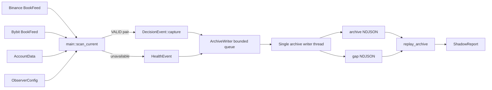

# A-05 行情归档与连续影子统计：设计文档

## 1. 设计目标

为只读 Binance/Bybit 现货套利观察器建立单一、可回放、可审计的观察证据链。归档不能反向阻塞行情主路径；任何丢失必须显式进入缺口日志；回放必须使用历史记录中的输入重算，而不是信任已保存输出或当前配置。

## 2. 模块边界与调用链



唯一职责：

- `src-tauri/src/main.rs` 与 `src-tauri/src/lib.rs`：桌面唯一进程入口、环境变量自动启动与退出冲刷；`src-tauri/src/commands/session.rs` 的 `SessionController` 管理连续观察会话生命周期。
- `crates/core/src/observer.rs`：实时数据编排、扫描/健康事件选择和归档生命周期。
- `crates/core/src/archive.rs::DecisionEvent`：冻结一次决策的全部重算输入与保存输出。
- `crates/core/src/archive.rs::ArchiveWriter`：分配运行 ID/序号、非阻塞提交、单线程追加写、缺口审计和优雅关闭。
- `crates/core/src/archive.rs::replay_archive`：固定长度顺序流式读取、结构与顺序校验、确定性重算、统计聚合。
- `crates/core/src/config.rs::ArchiveConfig`：归档路径、队列容量和保留期元数据校验。
- `config/observer.toml`：唯一配置样例；正式窗口经环境变量 `TAOLI_OBSERVER_ARCHIVE` 覆盖路径，不复制第二套配置。

## 3. 唯一数据契约

### 3.1 ArchiveRecord

每行是一个完整 JSON 对象并以换行结束：

- `schema_version`：当前为 1；不支持的版本拒绝回放。
- `event_id`：`<run_id>:<ordinal>`。
- `run_id`：`<启动毫秒>-<PID>-<进程内序列>`；每次写入器启动均变化。
- `ordinal`：运行内从 1 单调递增。
- `code_version`：Cargo 包版本。
- `recorded_at_ms`：归档封装时间。
- `raw_retention_days`：保留期声明，不代表已执行删除。
- `event_type`：`decision` 或 `health`。
- `event`：对应事件内容。

### 3.2 DecisionEvent

- `evaluated_at_ms`：本次扫描基准时间。
- `feeds`：双方 venue、symbol、状态、generation、reconnects、应用更新数和原因。
- `books`：双方完整决策深度、source/receive 时间戳和序列。
- `instruments`：双方品种精度、数量/名义金额约束、交易状态、订单能力和元数据版本。
- `fees`：双方买/卖 taker 费率、来源、加载/失效时间和是否为实际账户费率。
- `config`：symbol、资产、数量、策略成本和新鲜度约束。
- `config_version`：对序列化 `config` 内容计算 SHA-256。
- `admission_rejections`：账户与共享准入拒绝。
- `report`：保存的双向 `ScanReport`，供重算后做完全相等比较。

### 3.3 HealthEvent

包含观察时间、双方 `FeedVersion` 和 `skip_reason`。它表示该周期无法形成可复算决策，不得用零收益决策代替。

### 3.4 ArchiveGap

独立文件名为 `<archive filename>.gaps.ndjson`，记录：schema、run ID、受影响首末事件 ID、首末观察时间、丢弃数量、原因和记录时间。尾部修复使用 `dropped_events=0`，原因记录丢弃字节数。

## 4. 写入与背压设计

1. `ArchiveWriter::start` 校验容量大于 0，修复归档与缺口文件的无换行尾部，创建有界 `sync_channel` 和单一写线程。
2. 主路径为事件分配 ID 后调用 `try_send`，不等待磁盘。
3. 队列满时将连续丢弃合并为 `PendingGap`；下一次写线程处理记录或关闭时写入缺口日志。
4. 归档 I/O 失败时，本条事件进入缺口日志，归档句柄失效；下一条事件到达时重新尝试打开。
5. `finish`/`Drop` 关闭 sender，写线程排空队列、刷出待处理缺口并 `flush` 文件，然后 join。

取舍：保证行情主路径不因磁盘阻塞，但不保证每个事件一定落盘；完整性由缺口日志显式表达。若归档与缺口日志同时不可写，stderr 是唯一即时证据，窗口不得通过完整性门禁。

## 5. 状态、错误与降级语义

| 条件 | 主扫描行为 | 归档行为 | 回放/发布语义 |
|---|---|---|---|
| 双簿 `VALID` | 计算双向机会 | 写 `DecisionEvent` | 必须可精确重算 |
| 任一簿非 `VALID` | 失败关闭，不计算机会 | 写 `HealthEvent` | 计入失效区间 |
| 账户元数据不可用/过期 | 仍输出观察结果，机会拒绝 | 决策保存拒绝与回退费率来源 | 不得解释为可交易 |
| 队列满 | 扫描继续 | 合并写缺口 | 任何未解释丢弃阻止发布 |
| 归档 I/O 失败 | 扫描继续 | 写缺口并尝试后续恢复 | 不能声称归档连续 |
| 未完成尾行 | 在线回放忽略；重启截断 | 报告/审计字节数 | 非零值必须调查 |
| 完整损坏行 | 不自动修复 | 原文件保留 | 回放失败，人工调查 |
| 事件时间或序号回退 | 不排序掩盖 | 原文件保留 | 回放失败 |
| 保存结果被修改 | 不信任保存结果 | 原文件保留 | 重算不一致即失败 |

## 6. 回放算法与不变量

1. 打开归档并读取启动时 `metadata.len()`；使用 `take(bytes)` 固定本次视图。
2. 用 `BufReader::read_until('\n')` 顺序读取。最后一条无换行记录只计入 `ignored_incomplete_tail_bytes`。
3. 每条完整记录反序列化并验证 schema。
4. 全局事件观察时间不得倒退；每个 `run_id` 的 `ordinal` 必须严格递增。
5. 决策事件校验配置 SHA-256、双方均为 `VALID`、feed/book 身份一致，然后以归档中的盘口、规格、费率、配置、时间和准入拒绝调用 `scan_pair`。
6. 重算 `ScanReport` 必须与保存结果完全相等。
7. 顺序聚合时长、每运行的重连最大值、机会数和拒绝类别；收益与容量样本排序后计算 min/p50/p95/max；只保留最差五条尾部样本。
8. 以相同固定长度规则读取缺口日志并汇总缺口与丢弃数量。

关键不变量：

- 当前配置和交易所网络不能影响回放结果。
- 回放不排序记录；乱序是数据错误，不是可修复展示问题。
- `observed_duration_ms = last_event - first_event` 只是事件覆盖跨度。进程停机期间没有事件，因此它不能独立证明连续在线；最终评审必须外部核对重启与相邻事件间隔。
- 回放不把所有记录保存在内存，但收益和容量数组随方向评估数增长。按当前 2 秒周期、两个方向、14 天约 120 万个 `Decimal` 样本，内存可接受；更长周期需改为外部排序或流式分位数设计后另行评审。

## 7. 拒绝原因聚合

完整拒绝原文保留在 `DecisionEvent.report`。报告只使用稳定类别：

- 收益/基点不足、盘口过期、接收偏差；
- 分场所账户元数据刷新失败、权限、数量/名义金额、资格、凭证、实际费率等类别；
- 未识别内容统一为 `other_rejection_reason`。

这样报告键空间由代码定义，不受动态 HTTP 文本、数值和请求 ID 影响，同时不丢失原始调查证据。

## 8. 迁移与兼容策略

- 新归档 schema 从版本 1 开始；没有旧持久化 schema 需要迁移。
- `TAOLI_OBSERVER_ARCHIVE` 是对 `config.archive.path` 的运行时覆盖，避免为正式窗口维护第二份配置。
- `.gitignore` 排除整个 `data/`；原始高频记录不进入 Git。
- 预检默认归档 `data/archive/observations.ndjson` 与正式归档 `data/archive/a05-shadow-20260908.ndjson` 分离，正式报告不混入预检样本。
- 不提供跳过未知 schema、跳过损坏完整行或信任旧输出的兼容开关；这些行为会破坏证据链。

## 9. 删除或替换的旧路径

- 用 WebSocket 本地簿的归档决策替代无法重现接收状态的临时控制台观察。
- 用 `DecisionEvent` 中的配置/费率/规格快照替代回放时读取当前配置或重新请求交易所。
- 用固定长度顺序流式回放替代全文件加载后排序；排序会掩盖乱序，且全记录载入会随窗口无界增长。
- 用稳定拒绝类别替代把动态错误原文直接作为报告 Map 键。
- 不保留并行的旧归档格式或回放入口。

## 10. 验收场景到模块映射

| 场景 | 模块/符号 | 证据 |
|---|---|---|
| 决策精确回放与统计 | `DecisionEvent::replay`, `replay_archive` | `archives_replay_exactly_and_report_online_invalid_and_capacity_metrics` |
| 保存输出篡改 | `replay_archive` | `replay_rejects_a_decision_whose_saved_output_was_tampered` |
| 归档不可写 | `writer_loop`, `ArchiveGap` | `archive_io_failure_is_recorded_as_a_gap_without_failing_submission` |
| 在线半行 | `for_each_snapshot_record` | `replay_uses_complete_snapshot_while_last_line_is_still_being_written` |
| 崩溃尾部恢复 | `repair_incomplete_tail` | `restart_repairs_incomplete_tail_and_audits_discarded_bytes` |
| 完整损坏行 | `for_each_snapshot_record` | `replay_rejects_newline_terminated_corruption` |
| 时间倒退 | `replay_archive` | `replay_rejects_event_time_regression` |
| 动态拒绝文本 | `rejection_reason_category` | `rejection_report_normalizes_dynamic_errors_and_bounds_unknown_categories` |
| SIGTERM/关窗刷盘 | `src-tauri/src/lib.rs` 退出路径、`SessionController::stop`、`ArchiveWriter::finish` | release 进程受控停止后回放，36 条记录、未完成尾字节 0 |
| 实时在线回放 | `replay_archive`、桌面 `replay_observations` 命令 | 正式窗口首批 15 条记录，30 个方向、回放一致、缺口 0 |

## 11. 配置与运行契约

```toml
[archive]
path = "data/archive/observations.ndjson"
queue_capacity = 1024
raw_retention_days = 30
```

正式窗口以受管桌面进程运行（配置仍取 `config/observer.toml`）：

```bash
TAOLI_OBSERVER_AUTOSTART=1 \
TAOLI_OBSERVER_ARCHIVE=data/archive/a05-shadow-20260908.ndjson \
./target/release/personal-taoli
```

`TAOLI_OBSERVER_AUTOSTART` 任意非空即自动开始只读连续观察；`TAOLI_OBSERVER_ARCHIVE` 覆盖归档路径，缺省取配置。进程无订单入口；SIGTERM 或关窗先冲刷归档再退出。完整启动、停止、在线核对和最终评审见《A-05 连续影子观察运行与评审说明》。