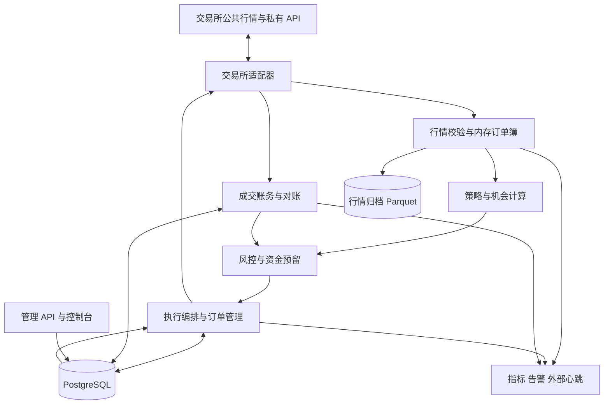

# 个人加密货币套利系统：架构与需求设计

> 文档版本：1.0  
> 文档性质：可用于需求评审、任务拆分和上线验收的设计基线；不是已实现系统或实盘收益报告。  
> 适用对象：单人开发维护、仅管理自有资金、通过合法可用交易所 API 交易。  
> 默认路线：预充值现货跨交易所套利 → 同交易所现货—线性永续对冲 → 经验证后再扩展其他策略。  
> 本文价格、手续费、资金规模、风险限额与性能指标均为设计示例或待验收目标，不代表实时行情、账户实际费率或收益承诺。

## 目录

1. 设计结论与关键取舍
2. 目标、假设与范围
3. 策略定义与收益模型
4. 功能需求与优先级
5. 非功能需求与服务目标
6. 总体架构与模块边界
7. 交易所接入与行情系统
8. 策略与资金分配
9. 执行系统与状态机
10. 资金、仓位与再平衡
11. 风险控制体系
12. 账务、估值与对账
13. 数据模型与事件协议
14. 管理接口与操作界面
15. 安全、权限与审计
16. 部署、备份与异常恢复
17. 监控、告警与值守
18. 仿真、测试与验收
19. 实施路线与成本
20. 上线决策与参考资料

---

## 1. 设计结论与关键取舍

### 1.1 推荐方案

采用**模块化单体交易核心 + 独立管理进程 + PostgreSQL + 文件行情归档**。

- 一个账户只有一个具有下单权的交易核心，不做双活交易。
- 行情、风控、资金预留、订单编排处于同一个低延迟进程内。
- 订单意图、资金预留、成交、账务和审计持久化；行情订单簿保留在内存。
- 控制台不持有交易密钥，不能绕过交易核心直接下单。
- WebSocket 接收行情和私有事件；REST 用于元数据、状态查询、快照和补偿对账。下单通道按交易所能力选用 REST 或交易 WebSocket。
- 开始只接入两家交易所、两个高流动性现货交易对；交易所和交易对均需通过准入审核。
- 采用预充值双边库存；跨交易所转账是低频资金管理，不是套利成交的一部分。
- 首期使用带价格边界的可成交限价 IOC 订单；不承诺双腿原子成交。
- 先具备风控、对账、断线恢复和小资金退出能力，再允许自动交易。

### 1.2 为什么不从复杂架构开始

| 选项 | 决策 | 原因 |
|---|---|---|
| 微服务、Kafka、Kubernetes | 首期不采用 | 增加一致性、网络和运维故障面，当前规模不需要 |
| Redis 作为资金账本 | 不采用 | 缓存不是资金与成交事实来源 |
| 毫秒级跨链搬砖 | 不采用 | 确认、充值、提现与跨链时延不可控 |
| 一开始覆盖几十家交易所 | 不采用 | 每家都需要独立订单语义和故障验收 |
| 自动提现 | 首期不采用 | 资金转移权限的损失半径远大于收益改善 |
| 高杠杆放大利差 | 不采用 | 净 Delta 小不代表没有强平、基差和流动性风险 |
| AI/LLM 直接决策和下单 | 不采用 | 核心路径必须可解释、确定、可回放；可用于离线分析和报告 |
| 全部自行实现 HTTP/签名 | 不作为默认 | 可复用维护良好的 SDK，但订单和风控语义由本系统负责 |

### 1.3 五项不可妥协的不变量

1. **状态未知不是订单失败，不得盲目重发。**
2. **未对账或关键数据失效时，不得增加新的策略风险。**
3. **资金预留、活跃订单和状态未知订单必须占用对应额度。**
4. **交易、手续费、资金费、划转必须可追溯，不能靠修改余额抹平差异。**
5. **暂停开仓、撤单、减仓和停止进程是四种不同动作。**

## 2. 目标、假设与范围

### 2.1 业务目标

系统应能持续回答：

- 当前价差是否在真实深度、实际费率和再平衡成本后仍可执行？
- 当前可用资金和交易所风险是否允许执行？
- 双腿不同时成交时，如何限制风险并恢复？
- 当日收益有多少来自价差，多少来自底仓涨跌或资金费？
- 如果程序、数据库、网络或交易所失效，已有订单和仓位如何处理？

成功不以“每天必须成交”衡量。没有合格机会时保持不交易是正常状态。

### 2.2 默认假设

| 项目 | 设计基线 |
|---|---|
| 用户 | 单个所有者，所有资金均为自有资金 |
| 账户 | 每个交易所使用独立子账户或专用账户，不与人工交易混用 |
| 市场 | 首期仅现货；后续仅增加明确支持的线性永续合约 |
| 币种 | BTC、ETH 等经过深度筛选的标的；名称不是准入保证 |
| 报价资产 | 首期同一报价资产，例如 USDT；仍单独监控其美元偏离 |
| 运行环境 | 一台持续运行的 Linux 主机；本地电脑仅开发和管理 |
| 策略权限 | 默认只读/模拟，实盘必须显式启用 |
| 资金转移 | 人工审批、人工在交易所执行，系统导入记录并跟踪到账 |
| 收益目标 | 不预设固定年化；先验证扣除全部成本后的样本外结果 |

本文不假设个人资金规模。所有实盘限额必须在启动前填入配置，缺失时拒绝启动实盘；后文数值只用于解释单位和验收方法。

### 2.3 策略边界

| 策略 | 范围 | 主要约束 |
|---|---|---|
| 预充值现货跨交易所 | 首期实现 | 库存、双腿风险、手续费、再平衡、底仓价格风险 |
| 现货多头 + 线性永续空头 | 第二阶段 | 资金费、基差、保证金、ADL、平仓成本 |
| 不同交易所永续多空 | 后续可选 | 各场所保证金不能自然互抵，结算时点不一致 |
| 单交易所三角套利 | 后续单独评估 | 三腿手续费、精度损耗、顺序执行和成交竞争 |
| CEX—DEX、跨链、MEV | 本设计首期不实现 | 需要额外钱包、签名、Gas、重组、滑点和链上执行模型 |
| 统计套利、网格、趋势交易 | 不属于本系统默认策略 | 其收益依赖方向或统计假设，不能混记为确定价差收益 |

### 2.4 上线前外部前提

必须核实所在地法律、交易所地区限制、KYC、API 使用条款、衍生品资格和税务记录要求。技术设计不构成这些条件已满足的证明，不通过规避地区限制获得交易访问。

## 3. 策略定义与收益模型

### 3.1 预充值现货跨交易所套利

在 A 预存报价资产，在 B 预存基础资产。当 A 的可执行买入价低于 B 的可执行卖出价时，在 A 买入、在 B 卖出。

执行后：

- A 的基础资产增加、报价资产减少。
- B 的基础资产减少、报价资产增加。
- 全账户基础资产总量近似不变，扣币手续费等会产生偏差。
- 后续等待反向机会，或执行付费再平衡。

**关键区别：交易的增量 Delta 可以接近零，但原先持有的 BTC/ETH 底仓仍有方向风险。不能把整个账户称为市场中性。**

系统必须区分：

1. 底仓目标及其价格损益。
2. 本次套利带来的现金流改善。
3. 未匹配成交导致的额外敞口。
4. 恢复可重复交易库存所需的实际成本。

如果用户不接受底仓方向风险，必须另行配置底仓对冲，并重新核算保证金和对冲成本；不能在现货策略中隐含假设存在对冲。

### 3.2 可执行价差

设买卖数量均为 q，C_buy(q) 是按 A 卖盘逐档成交的总买入金额，R_sell(q) 是按 B 买盘逐档成交的总卖出金额：

```text
预期净收益(q)
  = R_sell(q) - C_buy(q)
  - 两腿预期手续费
  - 尚未包含在订单簿价格中的时延/逆向选择损失估计
  - 分摊再平衡成本
  - 其他直接成本

准入收益(q) = 预期净收益(q) - 风险缓冲
准入净基点(q) = 准入收益(q) / C_buy(q) × 10,000
```

要求：

- 使用计划成交数量对应的 VWAP，不用最新成交价或只用买一卖一。
- 订单簿扫档已包含当前深度冲击，不再次重复扣除同一项“滑点”。
- 时延损失模型估计从决策到成交之间的新增损失，不混同于扫档成本。
- 风险缓冲是准入折扣，不是已实际发生的账务费用。
- 费率按账户、交易对、maker/taker、手续费抵扣状态获取并版本化。
- 买入手续费若以基础资产扣除，应按净到账量匹配卖出数量，并计算舍入后的残差。
- 多报价资产必须增加可执行兑换路径及兑换成本；首期直接拒绝此类路线。

### 3.3 经算术校验的示例

假设 q = 0.1 BTC，买入 VWAP 为 60,000 USDT，卖出 VWAP 为 60,180 USDT，两腿手续费均为 0.1%，手续费均按报价资产计，额外执行损失估计为 2 USDT，再平衡分摊为 1 USDT：

| 项目 | 结果 |
|---|---:|
| 买入金额 | 6,000 USDT |
| 卖出金额 | 6,018 USDT |
| 毛价差 | 18 USDT，约 30 bps |
| 买卖手续费合计 | 12.018 USDT |
| 扣除额外执行损失及再平衡后的预期净收益 | 2.982 USDT |
| 相对买入金额的预期净收益 | 4.97 bps |
| 相对约 12,000 USDT 双边预置资产价值的单次收益 | 0.02485% |

最后一行尚未计入额外现金缓冲。若准入净基点要求为 8 bps，此机会应被拒绝。表中价格与费率纯属算例，不代表该机会实际存在。

### 3.4 现货—永续对冲

推荐第二阶段先在同一交易所建立“买入现货 + 做空等基础资产数量的线性永续”，降低跨交易所补保证金的操作复杂度，但仍承担该交易所集中风险。

对固定匹配数量 q，忽略换汇且使用线性合约时：

```text
持有至 T 的净收益
  = q × [(F0 - S0) - (FT - ST)]
  + 实际收到的资金费 - 实际支付的资金费
  - 开平仓四笔交易手续费
  - 未包含在成交价中的其他执行成本
  - 借贷成本及其他直接费用
```

其中 S 是现货实际成交价，F 是永续实际成交价。发生加减仓时按成交批次核算，不能继续套用单一固定 q。

要求：

- 永续没有确定到期收敛，不能把开仓基差全部视为已锁定利润。
- 资金费预测、下一次待结算费率和已经入账的资金费分别存储。
- 结算间隔、下一结算时间、费率上下限按合约读取，不写死“每 8 小时”。
- 同时计算正常、费率转负、基差扩大和流动性恶化场景。
- 平仓比较的是“继续持有的边际预期收益”与风险，不要求赚回已发生的沉没成本才退出。
- 即使 Delta 接近零，空头保证金仍可能不足；现货浮盈不一定可用来抵扣合约账户损失。
- 检测强平和 ADL 导致的对冲腿变化，立刻重新计算组合敞口。

算例：q=0.1，S0=60,000，F0=60,300，ST=62,000，FT=62,100；两次资金费按标记价 61,000、62,000 和正费率 0.01% 结算，空头共收 1.23 USDT。现货手续费每次 0.1%，合约手续费每次 0.05%。基差收益 20 USDT，四笔手续费 18.32 USDT，其他成本前净收益仅 2.91 USDT。高资金费展示值并不自动意味着高净收益。

### 3.5 资金效率与收益率

- 策略收益率分母包括预置币、报价资产、保证金和必要备用金，不只使用单腿名义金额。
- 展示资本占用时间、每日资金周转和实际可执行容量。
- APR 外推与实际收益率分开显示；短期资金费率不得直接宣传为可持续年化。
- 分别展示税前交易损益、扣除基础设施后的经营损益；税务口径由当地要求确定。

## 4. 功能需求与优先级

P0 为首次实盘前必备；P1 为现货实盘稳定后增加；P2 为独立扩展，不影响 P0 完整交付。

| 编号 | 优先级 | 功能 | 可观察结果 |
|---|---|---|---|
| FR-01 | P0 | 交易所/品种准入 | 不支持的账户模式、订单类型、精度或地区条件不能启用 |
| FR-02 | P0 | 行情订阅与本地订单簿 | 断档、过期、重连重建期间不生成可执行信号 |
| FR-03 | P0 | 深度净收益计算 | 每个候选量可解释毛利、费用、缓冲和拒绝原因 |
| FR-04 | P0 | 资金与风险预留 | 两个机会不能重复使用同一份余额 |
| FR-05 | P0 | 双腿下单与部分成交补偿 | 支持成交不对称、拒单、超时、撤单竞态 |
| FR-06 | P0 | 幂等和重启恢复 | 重复通知及进程重启不重复记账、不盲目重单 |
| FR-07 | P0 | 实时风险闸门 | 额度、敞口、数据质量和亏损阈值能阻断开仓 |
| FR-08 | P0 | 资产、成交和资金账务 | 多币种费用、手工操作、充值提现可追溯 |
| FR-09 | P0 | 自动对账 | 差异分为延迟、缺失、冲突和已解释调整 |
| FR-10 | P0 | 管理与急停 | 暂停、撤单、受控减仓、恢复分别授权和记录 |
| FR-11 | P0 | 监控告警 | 私有流中断、裸露敞口、未知订单可被及时发现 |
| FR-12 | P0 | 回放及影子运行 | 不下实单也能运行相同策略与风控逻辑 |
| FR-13 | P0 | 人工再平衡记录 | 在途资金不被计算为目标场所可用余额 |
| FR-14 | P0 | 安全与配置版本 | 无提现权限、密钥隔离、变更可审计 |
| FR-15 | P1 | 现货—永续策略 | 管理资金费、基差、保证金和组合退出 |
| FR-16 | P1 | 自动再平衡交易 | 在预定费用和敞口预算内调整库存，不自动跨所提现 |
| FR-17 | P2 | 更多套利路线 | 每个新策略独立通过执行和风险验收 |

## 5. 非功能需求与服务目标

以下为起始验收目标，需在选择的主机和交易所链路上测量，不是外部交易所 SLA。

| 类别 | 设计目标/约束 |
|---|---|
| 初始规模 | 2 家交易所 × 2 个现货交易对；同一账户—品种最多 1 个活跃执行计划 |
| 扩展验收规模 | 3 家交易所 × 10 个品种；至少承受所录行情峰值的 3 倍回放速率 |
| 决策延迟 | 本地完成订单簿更新至策略和内存风控完成，p99 ≤ 20 ms；不含网络和持久化 |
| 下单前耐久化 | 决策完成至意图、预留和提交记录持久化，p99 ≤ 30 ms；单独测量 |
| 行情可用性 | 以交易所推送周期和实测延迟设门槛；不能用过宽 TTL 掩盖慢链路 |
| 外部 API 延迟 | 记录 p50/p95/p99；无统一毫秒保证，超时进入未知态 |
| 数据一致性 | 成交幂等入账、账务事务原子、账户单写者、所有状态可恢复 |
| 金额正确性 | 金额、数量和费率使用 Decimal/定点数；API 中以字符串传输 |
| 时间 | UTC 存储，单调时钟计超时，记录服务器时差及其不确定性 |
| 可恢复性 | 普通进程崩溃在原持久盘上恢复；开仓必须等对账完成 |
| 运行方式 | 7×24 小时观察；自动交易服从健康闸门，宁可停单不带病运行 |
| 日志 | 交易事件不得静默丢弃；行情归档缺口必须显式记录 |
| 可复现性 | 保存代码、配置、适配器、元数据和费率版本，以及决策行情引用 |

如果行情采样周期或网络延迟比机会寿命更长，应淘汰该机会类别，而不是仅更换编程语言。

## 6. 总体架构与模块边界

### 6.1 逻辑架构



图中的 DB → OM 表示交易核心读取持久化管理命令，不是从数据库驱动高频行情。

### 6.2 进程划分

**trading-core：唯一交易写入者**

- 持有交易 API 密钥。
- 运行适配器、订单簿、策略、风险、资金预留、执行和对账。
- 串行化共享账户风险状态；网络请求可以异步并发。
- 接收持久化控制命令，不开放任意交易所原始请求代理。

**control-api：管理进程**

- 提供只读报表和受限管理命令。
- 无交易所密钥，不直接修改余额、成交或策略内存。
- 命令带 request_id、操作者、配置版本、过期时间和审批信息。
- 控制台不可用不影响交易核心按已批准配置管理既有仓位。

**research/recorder：研究与归档任务**

- 离线回放、统计、压缩和报表不占用交易核心事件循环。
- 可与核心共享公共行情输入，但不共享实盘写入凭据。

**monitor：指标与外部心跳**

- 只读监控；默认无下单能力，避免第二个执行者。
- 核心失联时告警，由所有者从交易所原生终端执行恢复手册。

### 6.3 交易所适配器契约

```text
load_instruments() -> InstrumentSpec[]
load_account_capabilities() -> AccountCapabilities
stream_orderbook(instrument) -> BookEvent
stream_private_events() -> PrivateEvent
get_account_snapshot() -> AccountSnapshot
submit_order(OrderRequest) -> SubmitResult
cancel_order(OrderKey) -> CancelResult
query_order(OrderKey) -> OrderObservation
fetch_fills(cursor, overlap_window) -> FillPage
fetch_cashflows(cursor, overlap_window) -> CashflowPage
get_exchange_health() -> VenueHealth
```

SubmitResult 必须能表示 ACCEPTED、DEFINITELY_REJECTED、UNKNOWN。交易所返回“已接受请求”不得被映射成 FILLED。

统一接口只统一可以安全统一的字段。以下能力必须显式声明，不得默默模拟：IOC/FOK、post-only、reduce-only、按 client_order_id 查询、撤单确认方式、成交历史覆盖范围、私有流恢复、账户模式、资金费字段语义。

## 7. 交易所接入与行情系统

### 7.1 交易所准入

每家交易所建立能力卡：

- 地区与账户资格、现货/衍生品可用性。
- 下单、查单、撤单、成交历史与资金流水能力。
- API key/IP/账户级限频和订单数限制。
- 私有流会话寿命、心跳、断线与序列规则。
- client_order_id 的长度、字符、作用域、唯一性周期及复用规则。
- IOC/FOK 和市价保护的实际语义。
- 实际费率、手续费币种、最小金额、数量步长、价格限制。
- 账户资产隔离、保证金模式、持仓模式和风控限制。
- 提现状态、网络支持、最小充值和确认要求。

缺少可靠订单恢复能力的交易所不得用于自动实盘。本文引用的 Binance、Bybit 是协议实例，不构成交易所推荐。

### 7.2 品种归一化

InstrumentSpec 至少包含：

```text
venue, account_type, venue_symbol, canonical_instrument_id
base_asset_id, quote_asset_id, settlement_asset_id
market_type, linear_or_inverse, contract_multiplier, quantity_unit
price_tick, quantity_step, min_quantity, min_notional, max_notional
trading_status, supported_order_types, metadata_version
```

- BTC/USDT 现货与 BTC/USDT 永续是不同 instrument。
- 同名代币不一定是同一种资产；充值网络和合约地址独立维护。
- 合约“张数”必须转换为基础资产敞口后才能配对。
- 首期未实现反向合约损益与 Delta 模型，因此直接拒绝反向合约。

### 7.3 本地订单簿流程

1. 建立增量订阅并暂存事件。
2. 请求 REST 深度快照。
3. 按该交易所协议衔接快照与增量序列。
4. 丢弃已覆盖事件，应用有效增量，执行可用的序列或 checksum 校验。
5. 出现缺口、校验失败、快照过期或连接切换，立即标记 INVALID。
6. 清理旧代次状态，重新同步；只有同步完成才发布 VALID 订单簿。

特别要求：不同交易所的增量可能表示“新数量”或“数量变化”，不得套用统一文本替换规则。Binance 文档明确要求断档重建，数量为零时删除档位，并指出初始快照之外档位可能不完整。[1]

### 7.4 新鲜度与时间

每条事件记录：exchange_ts、receive_wall_ts、receive_monotonic_ts、connection_epoch、sequence。

- 接收后的排队年龄由单调时钟计算。
- 有交易所时间时，结合时钟偏差估计来源年龄，并保存误差范围。
- 跨交易所快照没有全局原子时刻；同时检查各腿年龄和配对时间差。
- 没有可信交易所时间时降低数据质量等级，不能假装测得单向网络延迟。
- 只有心跳正常但价格流长时间不更新，不等于行情可交易。

### 7.5 限频与背压

- 每个交易所实现账户/IP/端点权重联合限流，并参考实时响应头。
- 优先级：风险处置查单与撤单 → 私有状态恢复 → 正常下单 → 背景查询。
- 为查单、撤单与紧急对冲保留容量，不能由行情快照耗尽。
- 收到限流遵守 Retry-After 或交易所规定，不通过加 key 规避共享 IP 限额。[2]
- 订单簿增量不能随意丢弃；队列溢出时让该簿失效并重建。
- 策略通知可以合并为“处理最新有效簿”；旧机会到期后丢弃。
- 归档积压可按策略降采样，但必须标记数据缺口；不得影响私有成交处理。

## 8. 策略与资金分配

### 8.1 机会对象

```text
opportunity_id, strategy_id, strategy_version
buy_instrument, sell_instrument, direction
book_refs, observed_at, expires_at
candidate_quantity, expected_buy_cost, expected_sell_proceeds
fee_estimates, latency_loss_estimate, rebalance_estimate, risk_buffer
expected_net_pnl, admission_net_bps
inventory_before, inventory_after, rejection_reasons
```

策略只能提交机会，不能调用交易所下单。

### 8.2 数量选择

对有限个候选数量计算净收益，而不是固定“大单吃满”或只追求最高百分比：

```text
最大可选数量受限于：
  买方报价资产与手续费余额
  卖方基础资产与手续费余额
  双腿有效深度及价格保护
  双方数量精度和最小金额
  单笔、品种、交易所与全局额度
  库存目标偏离
  最坏未匹配敞口预算
```

先按双方数量步长得到可实现匹配量，再重算费用、残差和最低金额；不可先批准大数量，再在适配器中静默舍入。

### 8.3 分配与竞争

- 对共享账户资金，在同一账户执行域串行完成风险检查与预留。
- 机会排序综合净收益、资金占用、库存改善和执行风险，不只看毛价差。
- 相同交易对在一个计划未完成时不再开第二个计划，避免自有订单相互追逐。
- 买卖方向改变必须重新评估，不复用过期快照。
- 执行前再次检查行情 TTL、风险状态和配置版本。

## 9. 执行系统与状态机

### 9.1 正常执行流程

1. 策略提交机会。
2. 风控校验全局状态、数据健康、额度和两腿最坏敞口。
3. 在一个数据库事务中创建 execution_plan、risk_decision 和双腿资金预留。
4. 提交前重新检查机会有效期；过期则未下单释放预留。
5. 生成两腿独立且持久化的 client_order_id，记录提交意图。
6. 在两个健康连接上并发发送带限价保护的 IOC 订单。
7. 消费私有成交和订单事件；必要时 REST 查单。
8. 根据实际净成交量计算残差；撤销尚未终结的剩余订单或执行受控补偿。
9. 对账确认订单、成交、费用与余额，释放剩余额度。
10. 记录已闭合套利结果；不能把“已提交双腿”计为成功。

IOC 允许部分成交；FOK 只约束单个交易所的一笔订单，不能让跨交易所两腿成为原子事务。

### 9.2 执行计划状态

```text
DETECTED -> RESERVED -> SUBMITTING -> WORKING
WORKING -> RECONCILING -> COMPLETED
WORKING -> UNBALANCED -> HEDGING -> RECONCILING
SUBMITTING / WORKING / HEDGING -> INVESTIGATING
INVESTIGATING -> WORKING / UNBALANCED / RECONCILING / MANUAL_REQUIRED
DETECTED / RESERVED -> ABORTED
```

语义：

- ABORTED：未产生交易所副作用，或已证明无任何成交/活动订单。
- UNBALANCED：已确认两腿净成交不匹配。
- INVESTIGATING：可能存在未确认交易所副作用，预留不能释放。
- COMPLETED：所有子订单终态、残差在获批容差内、成交已入账且完成对账。
- MANUAL_REQUIRED：自动恢复条件不足，禁止该执行域新增风险，已有风险继续监控。

COMPLETED 不等于盈利；补偿成交可能让该计划最终亏损。

### 9.3 订单状态与观测状态分离

订单交易状态：

```text
PENDING_SUBMIT -> LIVE -> PARTIALLY_FILLED -> FILLED
PENDING_SUBMIT -> REJECTED
LIVE / PARTIALLY_FILLED -> CANCELED / EXPIRED / FILLED
```

另设：

```text
submission_status = NOT_SENT | IN_FLIGHT | ACCEPTED | DEFINITELY_REJECTED | UNKNOWN
cancel_status = NONE | REQUESTED | UNKNOWN | CONFIRMED
reconciliation_status = PENDING | MATCHED | CONFLICT
```

- 撤单请求成功送达，不表示订单已取消。
- CANCELED/EXPIRED 仍可能有部分成交，不能把累计成交量清零。
- 迟到成交必须入账；如果与已有终态矛盾，进入冲突对账，而不是简单丢弃。
- 已入账成交按唯一成交标识去重，累计成交量按交易所规则合并，不盲目相加。
- 查单暂时“未找到”不自动证明未提交，需考虑数据源延迟和查询范围。

### 9.4 超时、幂等与提交不确定性

Binance 官方说明，超时和部分服务端错误可能意味着执行状态未知，撮合引擎可能已经接受或执行请求。[2]

处理规则：

1. 发送前耐久化订单意图、client_order_id、请求摘要和资金预留。
2. 超时后置 UNKNOWN，保留资金和风险额度。
3. 同时检查私有流、按 client_order_id/order_id 查单和带重叠窗口的成交补拉。
4. 使用有限退避和适配器规定的历史可见性窗口，不高频轮询轰炸。
5. 只有明确拒绝或有可靠“未产生副作用”证据，才允许原业务意图发起新尝试。
6. 每个实际新尝试使用可区分的 attempt_id；未知请求不能通过更换 ID 绕过保护。
7. 超过调查时限仍未知，隔离执行域并报警；不自动把状态改为失败。

client_order_id 不是跨交易所、跨时间无限有效的 exactly-once 保证。本系统采用“持久意图 + 至少一次事件接收 + 幂等账务 + 状态调查”，不承诺外部交易所端到端 exactly-once。

### 9.5 部分成交与补偿

确认买入净到账 0.006 BTC、卖出 0.004 BTC 时，额外净多头为 0.002 BTC。处置按以下顺序评估：

1. 确认剩余原订单是否仍可能成交，避免补偿后原订单继续造成反向敞口。
2. 取消或查明原订单剩余数量。
3. 在原卖出场所继续卖出、在原买入场所回卖或在获批对冲场所对冲，比较可执行成本和风险。
4. 补偿订单仍经过专门风险闸门，有数量上限、价格边界、最大尝试数和累计损失预算。
5. 小于最小下单量的残差进入 dust 台账，累计到可处理量或人工清理；不忽略其价值。
6. 超出自动处置预算，升级告警和人工接管，不无限追价或反复加仓摊平。

### 9.6 未知订单的敞口区间

当买腿可能成交 0～0.01 BTC，而卖腿确认成交 0.005 BTC，实际新增敞口是 [-0.005, +0.005] BTC，不是确定的 -0.005 BTC。

- 风控保存确定敞口与可能敞口上下界。
- 优先查明状态，不默认按“最坏一边”全量对冲，否则另一真实状态可能被反向放大。
- 只有能降低最大可能绝对敞口且符合明确预算的动作，才可自动执行。
- 区间内无法找到安全动作时暂停该域并人工接管；不能宣称已对冲完成。

### 9.7 双腿故障矩阵

| 买腿 | 卖腿 | 动作 |
|---|---|---|
| 完全成交 | 完全成交 | 对账、记录净成交和费用 |
| 部分成交 | 部分成交 | 按净数量差处理残差；不能只比较订单状态 |
| 完全/部分成交 | 明确拒绝 | 限时、限额补偿，必要时回退买腿 |
| 明确拒绝 | 完全/部分成交 | 限时补买或撤销卖出造成的库存偏差 |
| 未知 | 已成交 | 建立可能敞口区间、查单，不盲补 |
| 未知 | 未知 | 冻结预留、调查两腿、停止新增计划 |
| 未成交终态 | 未成交终态 | 无成交结束，释放预留 |
| 撤单中 | 成交继续到达 | 更新累计成交，重新计算残差 |

## 10. 资金、仓位与再平衡

### 10.1 四类资金状态

- **交易所余额**：free、locked、total，附观测时间和来源。
- **本地预留**：已批准尚未被可靠交易所状态覆盖的资金占用。
- **在途资金**：已从源账户扣除但目的账户尚未最终到账。
- **安全缓冲**：禁止被正常策略使用的费用、补偿和保证金备用额。

本地可用额不能简单写成“最新 free 减去所有预留”。交易所 free 可能已经扣掉活动订单锁定资金，再扣一次会重复冻结。

实现要求：预留跟踪 LOCAL_RESERVED、EXCHANGE_LOCKED、CONSUMED、RELEASED 及其观测依据；用一致的账户快照加已确认增量重建可用额。无法可靠关联时取保守值并暂停新增，而不是猜测余额时间顺序。

### 10.2 库存目标

按 venue × asset 配置目标值、下限、上限和恢复区间。

再平衡优先级：

1. 利用符合净收益要求的反向套利自然恢复。
2. 通过有预算的现货交易调整库存。
3. 人工跨交易所划转。

不得为了恢复库存将负收益交易伪装成套利收益；再平衡费用单独归集并分摊。

### 10.3 人工划转工作流

```text
PROPOSED -> APPROVED -> SUBMITTED_EXTERNALLY -> IN_TRANSIT
IN_TRANSIT -> CREDITED -> RECONCILED
SUBMITTED_EXTERNALLY / IN_TRANSIT -> INVESTIGATING / FAILED
```

记录源/目标账户、资产、网络、地址白名单版本、memo/tag、金额、手续费、外部流水号、txid、预计确认和实际到账时间。

- 人工提交前检查网络、代币合约、memo/tag、最低充值和充值提现状态。
- 链上确认不等于交易所已经入账。
- 提现申请未知时不得重复申请，先查询外部记录。
- 内部划转不是收益；跨自有账户划转在合并净值中不算外部出入金。
- 转账损失、网络费与稳定币兑换损失必须入账。

## 11. 风险控制体系

### 11.1 三层风控

**准入层**：交易所资格、品种、账户模式、密钥权限、健康度。

**交易前层**：机会有效性、资金、精度、最坏成交敞口、费用、额度和日内风险预算。

**交易中/后层**：实际残差、未知订单、保证金、净值、流动性、对账和平台集中风险。

风控故障默认拒绝新增风险；已有风险处置使用单独明确的降风险路径，不允许任意 bypass。

### 11.2 风险维度

| 风险 | 检测量 | 默认处置 |
|---|---|---|
| 行情陈旧或断档 | 年龄、序列、checksum、跨腿时间差 | 停止依赖该簿的新交易 |
| 双腿不匹配 | 确定 Delta、可能 Delta 区间、持续时间 | 查单、撤单、受控补偿 |
| 余额不足或漂移 | 预留与交易所快照差异 | 冻结账户域并对账 |
| 交易所故障 | 连接、错误率、延迟、维护状态 | 禁用该场所的新机会 |
| 交易所集中 | 单场所资产及应收占总策略权益比例 | 限制新增，安排人工分散 |
| 底仓方向风险 | 相对目标底仓的偏差、绝对币资产价值 | 分别限额；不能只看新增 Delta |
| 稳定币风险 | 报价/抵押资产相对参考货币偏离 | 折价估值、限制新风险、受控退出 |
| 衍生品强平 | 标记价、维持保证金、账户权益、压力结果 | 提前减仓，不能只等强平价临近 |
| 资金费反转 | 下一周期预测和历史分布 | 重算继续持有价值，不无条件追逐高费率 |
| ADL/强平 | 仓位突变和交易所事件 | 重算净 Delta，处理残余腿 |
| 净值亏损 | 现金流调整后的日内亏损和高水位回撤 | 只减仓、告警、人工批准恢复 |
| 资产身份异常 | 代币合约、网络或产品规格变化 | 禁用该品种，不根据相同 ticker 自动配对 |

### 11.3 示例参数及单位

这些参数用于影子运行和评审。实盘必须按资金规模、最小订单、订单簿推送频率与链路实测重新批准；不是通用“安全值”。

| 参数 | 示例值 | 明确定义 |
|---|---:|---|
| 单次计划名义上限 | 100 USDT 等值 | 按较大一腿名义价值，不是双腿相加 |
| 同一账户—品种活跃计划数 | 1 | 包括未知和补偿中的计划 |
| 准入净收益下限 | 0.20 USDT 且 8 bps | 两项同时满足，已扣风险缓冲 |
| 订单簿来源年龄上限 | 500 ms | 必须适配真实推送周期；超限不交易 |
| 双腿观测时间差上限 | 250 ms | 不代表两所撮合同时发生 |
| 新开仓价格额外偏移上限 | 5 bps | 相对批准时参考价的额外保护预算 |
| 未匹配敞口软限额 | 20 USDT 等值 | 触发快速处置；不是平时允许长期持有 |
| 单计划可能敞口硬限额 | 100 USDT 等值 | 开仓前按“一腿全成、另一腿零成”校验 |
| 未匹配敞口时间预算 | 2 s | 触发升级，不承诺 2 秒内一定平掉 |
| 单计划自动补偿损失预算 | 1 USDT | 超限进入人工接管；不保证最终损失不超此值 |
| 单日策略亏损开仓熔断 | 日初策略权益的 0.5% | 同时配置绝对金额上限，先触发者生效 |
| 高水位回撤开仓熔断 | 3% | 高水位经外部资金流调整 |
| 单交易所资产上限 | 全部策略资本的 40% | 两家各最多 40%，其余至少 20% 留在所外；所外资金不能当即时保证金 |

首期 100 USDT 计划上限意味着单腿全成时也可能出现约 100 USDT 暴露；只配置 20 USDT 硬限额却允许 100 USDT 并发 IOC 是自相矛盾的。系统配置校验必须发现这类冲突。

### 11.4 运行模式

```text
OBSERVE：只读采集，不产生实盘交易。
PAPER：仿真资金、仿真成交，禁止实盘密钥使用。
LIVE：正常策略交易。
REDUCE_ONLY：禁止新套利计划，仅允许经审核的风险降低动作。
HALTED：禁止自动下单，保留查单、对账和告警；可能仍有仓位。
```

现货不支持交易所原生 reduce-only 时，由系统基于当前/可能敞口验证动作；衍生品同时使用交易所原生 reduce-only 防止平仓变反向开仓。合法性按账户持仓模式验证。

任何熔断不自动恢复 LIVE。重建行情、完成对账并由所有者批准后才能恢复。

### 11.5 急停语义

- **暂停开仓**：立即阻断新计划，继续管理已有订单。
- **撤销策略挂单**：按确认的订单集合发撤单并追踪最终结果，不擅自撤销账户内非本系统订单。
- **受控降低敞口**：按实时状态和预算下对冲/减仓单。
- **停止程序**：完成可完成的状态保存后退出；不等于平仓完成。

“点击急停就保证清空所有仓位”不是可实现承诺，交易所不可用时只能记录风险并人工接管。

## 12. 账务、估值与对账

### 12.1 事实来源与账本

- 交易所成交、资金流水与账户快照是外部业务事实。
- 本地不可变事件和账务分录是可审计记录；快照用于核对而不是覆盖历史。
- 使用多资产子账本，按资产单位保持分录平衡；不同资产数量不能直接相加。
- 交易通过资产交换/清算账户记录，费用通过对应资产费用账户记录。
- 每条分录关联外部成交或流水标识、业务事件和估值依据。
- 错误通过冲正和更正分录修复，不 UPDATE 历史分录改成想要的数字。
- 会计报表的本位币折算和税务成本法独立配置；不把内部策略归因当作税务结论。

### 12.2 盈亏分解

至少展示：

1. 匹配套利成交价差。
2. 底仓持有损益及库存成本归因。
3. 合约已实现与未实现损益。
4. 手续费及手续费币估值变化。
5. 已结算资金费。
6. 借贷利息。
7. 补偿和再平衡实际费用。
8. 稳定币/报价资产相对报告货币的估值变化。
9. 基础设施成本。

预期收益、预计再平衡分摊、风险缓冲与已发生费用分别存储，避免重复扣减。现金流改善不应覆盖现货原有成本基础的会计损益。

### 12.3 净值公式

```text
策略损益 = 期末策略净值 - 期初策略净值 - 期间外部净流入
```

对保证金账户，净值使用适配器归一化后的钱包余额、未实现损益和负债模型，不能把保证金、可用余额和权益三者再次相加。

- 内部账户划转和在途资产只计一次。
- 交易所应收、借贷负债和已扣未到账资产纳入净值。
- 多头库存提供中间价估值与可清算估值；风控偏向更保守的可清算估值。
- 报价资产与 USD 不强制按 1:1 记账。
- 保留价格来源、时间和 stale 标志；估值不可靠时不生成“准确净值”假象。

### 12.4 对账频率

| 对象 | 触发 | 校验内容 |
|---|---|---|
| 订单/成交 | 私有事件实时；未知订单立即；正常补拉按限频调度 | 活动订单、累计成交、漏报、重复、迟到 |
| 余额 | 启动、重连、交易结束及周期快照 | 各资产 total/free/locked 和本地预留归属 |
| 仓位/保证金 | 私有事件与周期快照 | 数量、方向、模式、权益、强平/ADL |
| 资金费/利息/划转 | 结算或操作后补拉，每日完整核对 | 金额、币种、外部标识和归属 |
| 日结 | 每日固定 UTC 截点 | 净值、现金流、费用和未解决差异 |

快照不是跨接口原子状态：对账采用观测时间、游标、重叠拉取和后续重试，先解释时序差异，再认定资金异常。所有未知或冲突都要有工单状态，不能永远显示为“同步中”。

## 13. 数据模型与事件协议

### 13.1 PostgreSQL 主要表

| 表 | 关键字段与约束 |
|---|---|
| venues / accounts | 账户模式、准入状态、密钥引用；不存明文 secret |
| instruments | 规范品种、交易所符号、规格、元数据版本 |
| fee_schedules | 账户/品种费率、币种规则、生效时间、来源 |
| strategy_configs | 策略版本、风险参数、审批记录、生效时间 |
| opportunities | 行情引用、候选量、预期成本、准入结果 |
| execution_plans | 策略、状态、目标数量、敞口区间、配置版本 |
| orders | plan_id、leg_id、attempt_id、client_order_id、外部订单 ID、数量、状态 |
| order_events | 原始事件引用、标准化状态、累计成交、来源时间 |
| fills | 交易所/账户/必要时品种范围内的成交唯一键、价格、数量、费用明细 |
| fund_reservations | 账户/资产、金额、计划、预留状态、覆盖快照依据 |
| cashflows / transfers | 流水类型、资产、金额、外部标识、在途与到账状态 |
| ledger_entries / ledger_lines | 业务事件唯一键、资产、借贷方向、数量、估值、冲正关系 |
| balance_snapshots / position_snapshots | 观测时间、来源、完整性、归一化资产与仓位 |
| risk_events / reconciliation_runs | 规则、阈值、输入、动作、差异及解决结果 |
| control_commands / audit_logs | request_id、操作者、期望版本、执行状态与结果 |
| event_log | event_id、aggregate_id、aggregate_version、类型、payload、schema_version |

外部 ID 唯一作用域按交易所定义，不能假设 trade_id 在全平台永久唯一。需要品种参与唯一键时必须加入。client_order_id 在本系统内部不复用。

### 13.2 事务边界

- 批准计划、资金预留和风险审批记录在同一事务提交。
- 单条成交入库、对应账务分录和必要余额派生状态在同一事务提交。
- 控制命令具有幂等 request_id；重复请求返回原命令结果。
- 外部 API 调用不能包含在数据库 ACID 保证中，使用持久化意图与结果调查解决崩溃窗口。
- 状态物化表与事件在同一事务更新；不用全系统事件溯源增加复杂度。

### 13.3 标准事件信封

```json
{
  "schema_version": 1,
  "event_id": "unique-event-id",
  "event_type": "OrderFillObserved",
  "aggregate_id": "internal-order-id",
  "aggregate_version": 7,
  "correlation_id": "execution-plan-id",
  "causation_id": "parent-event-id",
  "venue": "venue-a",
  "account_id": "spot-account-a",
  "instrument_id": "venue-a:spot:BTC-USDT",
  "source_time": "2026-01-01T00:00:00.100Z",
  "received_time": "2026-01-01T00:00:00.130Z",
  "payload": {
    "trade_id": "external-fill-id",
    "quantity": "0.001",
    "price": "60000.00",
    "fees": [{"asset": "USDT", "amount": "0.06"}]
  }
}
```

事件内容仅为协议示例。没有可靠 source_time 时使用 null 并记录质量等级，不能制造时间精度。

### 13.4 数据保留与容量

- 订单、成交、账务、审计：建议保留至少 5 年，并以适用法律要求为准。
- 原始私有事件：建议热存 90 天，压缩归档后保留以支持争议复核。
- 高频行情：按品种和日期分区，初始原始数据保留 7～30 天，聚合特征更久。
- 数据缺口、交易发生附近行情和异常案例单独保留。
- PostgreSQL 不存每一笔完整订单簿；行情写 Parquet，研究用 DuckDB。

容量估算：若总计 1,000 条消息/秒、平均 500 字节，未压缩约 43.2 GB/天。应先采样实测再配置保留周期、磁盘和归档预算，不能默认“小账户的数据也很少”。

## 14. 管理接口与操作界面

### 14.1 页面

**总览**：运行模式、账户净值、数据健康、未匹配敞口、未知订单、当日收益分解。

**机会**：买卖场所、VWAP、可成交量、费用、准入净收益、库存影响、拒绝原因、行情年龄。

**执行详情**：完整计划时间线、两腿订单、实际成交、补偿动作、原始事件和对账结果。

**资产与风险**：各所资产、预留、在途、集中度、底仓目标、绝对和增量 Delta；启用衍生品后显示保证金和基差。

**策略配置**：版本、启停、交易对、名义限额、费用与风险预算；变更前展示差异。

**运维与审计**：连接、限频、延迟、重建、告警、命令结果、恢复审批。

### 14.2 管理 API

| 接口 | 语义 |
|---|---|
| GET /v1/status | 返回模式、数据健康和开仓阻断原因 |
| GET /v1/opportunities | 查询候选机会与拒绝原因 |
| GET /v1/executions/{id} | 查询执行计划及订单/成交时间线 |
| GET /v1/portfolio | 查询净值、资产、敞口、预留和在途 |
| GET /v1/pnl | 查询按策略、时间、费用类别拆分的损益 |
| POST /v1/commands/pause | 持久化暂停开仓命令 |
| POST /v1/commands/cancel-orders | 提交明确范围的撤单命令 |
| POST /v1/commands/reduce-exposure | 提交带资产/数量/损失边界的风险降低命令 |
| POST /v1/commands/resume | 在对账与健康校验通过后申请恢复 |
| POST /v1/config-versions | 创建待批准配置，不直接覆盖正在执行的配置 |
| GET /v1/commands/{id} | 查询 RECEIVED/EXECUTING/SUCCEEDED/FAILED/PARTIAL 及明细 |

写接口返回命令接收状态，不把 HTTP 200/202 解释为交易动作已完成。控制命令过期不得在几小时后恢复连接时自动执行。

## 15. 安全、权限与审计

### 15.1 权限隔离

- 开发、模拟、实盘使用不同账户或至少不同密钥，模拟进程拿不到实盘密钥。
- 实盘交易 key 只开放必要的读取与交易权限，关闭提现权限。
- 如交易所支持，使用 IP 白名单与独立子账户。
- 控制台和监控使用独立只读数据库角色；管理命令表只允许受限写入。
- 所有者日常查看使用只读会话，恢复交易和改变资金限额需要二次认证。
- 人工操作尽量走管理命令；紧急直接操作交易所后必须触发强制对账。

### 15.2 密钥与网络

- secret 存储在系统凭据服务、云 Secrets Manager 或加密文件中，解密材料不进仓库。
- 日志、错误上报、截图和回放数据脱敏签名、密钥和敏感账户信息。
- 管理面仅通过 VPN/Tailscale 等私有通道访问；数据库不暴露公网。
- TLS 校验不能关闭；固定依赖版本并审查升级。
- 私钥如未来用于 DEX，应使用独立签名边界；本期服务不保管链上热钱包私钥。

### 15.3 审计字段

actor、action、request_id、before/after 配置哈希、批准版本、时间、来源会话、结果、关联订单/计划。

同机数据库审计只能防误操作，不能保证抵抗主机管理员篡改；需要该威胁保障时将审计定期发送到独立凭据控制的不可变对象存储。

## 16. 部署、备份与异常恢复

### 16.1 推荐技术栈

| 层 | 推荐 | 取舍 |
|---|---|---|
| 交易核心 | Python 3.12+、asyncio、Decimal、类型检查 | 适合单人迭代和研究；达到量化瓶颈后才考虑替换热点 |
| 交易接入 | 维护良好的 SDK/CCXT + 每所独立适配器 | 统一库降低接入成本，不代替交易语义验收 [5] |
| 管理 API | FastAPI | 与交易核心同语言，减少维护面 |
| 控制台 | TypeScript + 轻量 Web 界面 | 优先执行与风险信息，不建设复杂交易终端 |
| 交易数据库 | PostgreSQL | 事务、唯一约束、审计和恢复 |
| 行情与研究 | Parquet + DuckDB | 适合批量归档和离线查询 |
| 指标 | Prometheus + Grafana，外部心跳 | 指标、告警和进程外失联检测 |
| 部署 | Docker Compose 或 systemd，择一主方式 | 单机可维护；不同时引入多套进程管理 |
| 备份 | 加密对象存储 + PostgreSQL WAL 归档 | 与运行主机隔离 |

金额运算不使用 float；非资金统计可以使用浮点。策略计算不做逐 tick 数据库查询，订单关键持久化不能为了吞吐随意异步丢失。

### 16.2 初始部署资源

建议起始测量环境为 4 vCPU、8 GB RAM、100～200 GB SSD，交易与数据库资源限制分别配置。若完整采集高频深度，容量以实测为准，可能需要更大磁盘或更短保留周期。

选择主机区域依据：所在地与交易所允许范围、两所 API 的实测延迟分布、稳定性和恢复便利性，不根据宣传“离撮合最近”直接决定。

### 16.3 单写者与防脑裂

- 通过主机服务管理和进程锁确保本机只有一个 trading-core。
- PostgreSQL 会话锁用于辅助排他；失去排他状态时阻断新增交易。
- 数据库锁或租约不能撤回已经发出的交易所请求，因此不单靠租约实现自动跨主机接管。
- 冷备/备用主机只有在确认原核心已停机或其交易出口被隔离，并完成账户对账后才能获交易权。
- 交易所若不支持 fencing token，就不宣称数据库 token 可以阻止旧节点继续下单。

### 16.4 启动恢复顺序

1. 获得单写者资格，默认不开仓。
2. 加载最近配置、未终态计划、订单意图和预留。
3. 建立私有流并缓存新事件。
4. 拉取活动订单、近期成交、资金流水、余额和仓位。
5. 通过游标和重叠窗口合并缓存与补拉记录，幂等入账。
6. 处理未知订单、孤儿订单、迟到成交和冲突。
7. 重建资金预留和风险状态。
8. 重建行情订单簿。
9. 健康及对账通过后进入 OBSERVE/REDUCE_ONLY；实盘恢复依审批策略执行。

部署升级采用“暂停开仓 → 处理活动计划 → 持久化 → 停旧实例 → 数据迁移 → 启动新实例 → 对账 → 批准恢复”，禁止两个版本同时有交易权。

### 16.5 故障处置

| 故障 | 立即动作 | 恢复要求 |
|---|---|---|
| 公共行情断线 | 停止对应路线新交易 | 重新同步有效簿，不仅重连 socket |
| 私有流断线 | 阻断新风险，启用限频 REST 调查 | 活动订单、成交和余额补齐 |
| REST 超时/5xx | 订单可能 UNKNOWN | 查明副作用后再决策 |
| 数据库不可写 | 禁止新策略计划 | 保持唯一核心；只允许可可靠记录的紧急风险处置 |
| 本地磁盘满/持久化均失效 | 停止自动下单并最高级告警 | 从交易所人工管理，恢复后完整对账 |
| 进程崩溃/主机离线 | 外部心跳告警 | 人工确认交易所订单；按启动流程恢复 |
| 时钟偏差异常 | 暂停时间敏感新请求 | 恢复同步并校验有效请求窗口 |
| 交易所停机 | 不假装可撤单或平仓 | 记录可能敞口，评估其他获批场所对冲，人工接管 |
| 提现暂停 | 禁止依赖该路线的再平衡 | 调整库存与平台额度，不将余额视为可即时转移 |

数据库失效时，若仍要支持自动紧急撤单/对冲，P0 必须实现**本地 fsync 紧急日志**：仅原单写者可用，写入意图后发送请求，记录结果，恢复时先幂等导入再开放新交易。日志也不可写或核心没有可靠仓位状态时，不自动下单。此路径必须通过故障注入验收；不能把内存日志当成耐久日志。

### 16.6 备份与恢复目标

- 原盘完好的进程崩溃：已提交数据库事务和已 fsync 紧急日志目标不丢失。
- 主机或磁盘彻底丢失：初始异地恢复 RPO 目标 ≤ 5 分钟，不等于零数据丢失。
- 最近外部成交可从交易所重建，但原始决策与审计尾部可能无法恢复，需明确标记。
- 初始恢复 RTO 目标 ≤ 30 分钟，需演练；RTO 不是裸露敞口可承受时间。
- 每日备份、持续或短间隔 WAL 归档，至少每月做一次隔离恢复演练。
- 核对交易所历史接口保留期和分页限制，避免本地数据丢失后超出可追溯窗口。

## 17. 监控、告警与值守

### 17.1 指标

- 行情：连接、最近事件年龄、来源年龄估计、断档、checksum 错误、重建次数。
- 执行：计划数、拒绝原因、提交/确认/成交延迟、部分成交率、未知订单数量和年龄。
- 风险：确定/可能敞口、裸露持续时间、预留、场所集中、保证金压力结果。
- 收益：预期与实际净收益偏差、手续费、补偿成本、再平衡费用、资金占用。
- 对账：缺失成交、余额差异、冲突年龄、日结未完成项。
- 基础设施：CPU、内存、事件循环延迟、数据库延迟、磁盘、队列和外部心跳。

### 17.2 告警等级

| 等级 | 示例 | 处置 |
|---|---|---|
| P0 | 无法确认的大额敞口、保证金危险、交易核心失联且有仓位、持久化失效 | 立即推送到至少两个独立通道；人工从原生交易终端接管 |
| P1 | 未知订单超时、私有流中断、余额冲突、持续单场所故障 | 阻断对应新交易并尽快处理 |
| P2 | 库存偏移、行情延迟升高、归档积压、收益估计误差变大 | 降级或计划处理 |
| 信息 | 正常启停、配置批准、日结、再平衡到账 | 保留审计，避免通知噪声 |

建议本地检测到关键事件后 5 秒内提交告警，定期验证外部渠道实际送达；通知送达时间不由系统完全控制。

### 17.3 单人值守现实

- 所有者无法及时响应时，限制策略资本和故障持仓规模，必要时只观察。
- 需要持续保证金管理的策略，不应在缺乏故障处置方案时无人值守。
- 离开前检查是否有未知订单、挂单、合约仓位和转账在途。
- “关闭电脑”不是退出策略；交易核心必须运行在持续在线环境，且保留交易所原生登录备用路径。

## 18. 仿真、测试与验收

### 18.1 验证层级

1. **纯逻辑验证**：深度计算、精度、费用资产、数量匹配、风险限额和净值公式。
2. **适配器契约验证**：真实 API 的订单类型、拒单、查单、私有事件、费用字段和历史补拉。
3. **历史事件回放**：使用自采快照与增量，重建交易当时可见的信息。
4. **实时影子运行**：真实行情和账户费率，不下实单，运行同一策略与风控。
5. **受限小资金实盘**：验证真实成交、费用、部分成交、查单和日结。
6. **故障注入与恢复演练**：在隔离环境执行丢包、重复、断线、崩溃和数据库失效。

测试网用于协议和控制流程，不证明真实深度、滑点或盈利。不能只用 K 线回测短时订单簿套利。

### 18.2 回放与模拟成交要求

- 按历史可见信息推进，不提前使用未来盘口或下一结算实际资金费。
- 模拟决策、持久化、网络、撮合和回报时延，使用实测分布而非固定零时延。
- 处理盘口消失、竞争成交和数量不足；不能“看到卖一就假设全量可买”。
- 使用深度折扣/不利成交场景，并对假设做敏感性分析。
- 若扩展 maker 策略，需要排队和撤改单模型；未实现时不得展示可靠 maker 回测收益。
- 回放使用当时费率、最小金额和合约规格，避免幸存者偏差和未来元数据泄漏。
- 参数拟合和评估时间段分离；保留样本外与波动阶段。
- 模拟成交只是估计，最终以小资金真实成交误差校准。

### 18.3 关键验收用例

| 编号 | 场景 | 必须观察到的结果 |
|---|---|---|
| AT-01 | 同一价差，深度不足 | 数量缩小或拒绝，不按买一卖一虚报容量 |
| AT-02 | 手续费改为基础资产扣除 | 卖出匹配净到账量，残差入账，不隐含借币 |
| AT-03 | 两所数量步长不同 | 舍入后重算最低金额、收益与残差 |
| AT-04 | 行情增量丢一段 | 立即失效该簿，重建前没有新下单 |
| AT-05 | 订单提交成功但响应丢失 | 进入 UNKNOWN，查到原订单，不产生重复订单 |
| AT-06 | 查询暂时未找到订单 | 保留预留并继续按可见性规则调查，不直接重发 |
| AT-07 | 买腿成交、卖腿拒绝 | 在批准预算内补偿；超限显式升级，不隐藏亏损 |
| AT-08 | 一腿未知、一腿成交 | 风控显示敞口区间，不按单一假设全量补单 |
| AT-09 | 撤单请求后仍有成交 | 成交全部入账，补偿基于最终/可能数量 |
| AT-10 | 私有成交重复、乱序到达 | 一次经济成交只入账一次，不被旧状态回滚 |
| AT-11 | 两机会共享同一资金 | 预留原子互斥，不超卖/超买 |
| AT-12 | 下单前或下单后进程崩溃 | 重启调查原意图、成交和预留，不丢失责任订单 |
| AT-13 | 数据库中断且存在未匹配腿 | 无新开仓；紧急路径 fsync 后处置；恢复幂等导入 |
| AT-14 | 数据库和本地日志均不可写 | 无自动新下单，最高级告警与人工接管信息齐全 |
| AT-15 | API 429/限频 | 遵守退避，查单撤单仍有预算，不触发重试风暴 |
| AT-16 | 底仓币价下跌但套利有正价差 | 显示底仓亏损和套利收益，不虚报全账户盈利 |
| AT-17 | 自有账户划转未到账 | 在途计一次，不当收入，也不当目标账户可用余额 |
| AT-18 | 人工在原生交易所操作 | 检出外部变化，隔离并对账，不静默覆盖 |
| AT-19 | 稳定币偏离 1 USD | 本位币净值反映偏离，触发配置风险规则 |
| AT-20 | 暂停、撤单、减仓、停止 | 四种动作结果分别可查，无“暂停等于平仓”假象 |
| AT-21 | 旧主机未确认停止时启备用 | 备用拒绝获得实盘执行权 |
| AT-22 | 备份恢复 | 在隔离环境恢复账务并与外部/归档记录核对，测量 RPO/RTO |
| AT-23 | 资金费间隔变化或费率转负 | 更新结算计划与持有价值，不继续使用固定周期 [4] |
| AT-24 | 永续腿 ADL/强平 | 仓位变化被检测，重新计算 Delta 并处置残余现货 |
| AT-25 | 提交过期管理命令 | 命令拒绝或过期，不在恢复网络后意外执行 |

AT-23、AT-24 是启用衍生品前的必验项；其余相关 P0 项未通过不得开实盘。

### 18.4 上线门槛

**工程门槛**：所有 P0 风险路径通过，未解释账务差异为零；恢复演练完成；实际权限无提现；所有风险参数显式批准。

**观察门槛**：至少 14 天实时影子运行，覆盖重连、结算或维护时段；A-05 固定要求两个方向合计至少 100 个独立正净收益候选事件段、Binance 与 Bybit 各至少一次自然重连，以及至少一次真实 `非 VALID → VALID` 恢复。独立事件段按方向计算：`expected_net_profit > 0` 从非正值转入，或与上一条同方向正值样本相隔至少 30 秒时开始；持续正值段只计一次。没有机会或故障样本不能靠降低安全门槛、缩短间隔或人工重连制造。

**经济门槛**：保守执行假设下，样本外净收益扣除再平衡和基础设施后有正向证据，且不是由少数极端交易或底仓上涨贡献；报告机会数、分布、置信区间和尾部损失，不只报告平均收益。

**实盘门槛**：所有者批准专用小额试运行资本与最大损失。首次真实验证采用满足交易所最低金额的受限规模；扩大资金前需要真实费用、成交偏差、补偿成本和日结均达到预设标准。

验收失败时明确停在哪一层，不将“可以调用 API”称为“套利系统已可上线”。

## 19. 实施路线与成本

### 19.1 阶段交付

| 阶段 | 交付物 | 完成条件 |
|---|---|---|
| A：准入与观察 | 两所能力卡、只读接入、行情与费率采集、净收益报告 | 可解释机会，识别数据缺口，确认经济可行性值得继续验证 |
| B：安全交易核心 | 预留、执行状态机、账务、对账、幂等、风险控制 | 关键故障用例通过，所有真实副作用可恢复 |
| C：模拟与运维 | 回放、实时影子、控制台、告警、备份、紧急日志 | 负载及恢复实测达标，配置完成审批 |
| D：受限现货实盘 | 真实双腿、补偿、人工再平衡、日结 | 实际成本与估计偏差受控，未解释差异清零 |
| E：现货—永续 | 资金费、基差、保证金、ADL、组合退出 | 衍生品验收与压力场景通过后独立批准 |

每阶段都以可观察结果作为门槛，不用固定周数代替完成标准。接入更多交易所不是对现有恢复缺陷的补偿。

#### 当前实现状态（Rust 准入、观察、PAPER 安全核心与 Tauri 桌面控制台）

仓库已交付阶段 A 的第五个可运行闭环、B-01 的 PAPER 持久化安全核心、B-02 的 PAPER 订单事实与 `UNKNOWN` 状态机、B-03 的 PAPER 双腿执行事实与补偿决策闭环、B-04 的 PAPER 账务/对账/控制面闭环，以及 C-01 Tauri 桌面控制台；A-05 连续观察门槛仍未完成：
已拆分的迭代规范与交付记录：

- A-03：[需求](A-03-WebSocket本地订单簿-需求.md)、[设计](A-03-WebSocket本地订单簿-设计.md)、[任务](A-03-WebSocket本地订单簿-任务.md)；
- A-04：[需求](A-04-账户能力与实际费率-需求.md)、[设计](A-04-账户能力与实际费率-设计.md)、[任务](A-04-账户能力与实际费率-任务.md)；
- A-05：[需求](A-05-行情归档与连续影子统计-需求.md)、[设计](A-05-行情归档与连续影子统计-设计.md)、[任务](A-05-行情归档与连续影子统计-任务.md)、[运行与评审说明](A-05-连续影子观察-运行与评审说明.md)；
- B-01：[需求](B-01-耐久化意图资金预留与单写者-需求.md)、[设计](B-01-耐久化意图资金预留与单写者-设计.md)、[任务](B-01-耐久化意图资金预留与单写者-任务.md)；
- B-02：[需求](B-02-订单事实与UNKNOWN状态机-需求.md)、[设计](B-02-订单事实与UNKNOWN状态机-设计.md)、[任务](B-02-订单事实与UNKNOWN状态机-任务.md)；
- B-03：[需求](B-03-双腿执行与补偿风控-需求.md)、[设计](B-03-双腿执行与补偿风控-设计.md)、[任务](B-03-双腿执行与补偿风控-任务.md)；
- B-04：[需求](B-04-账务对账与控制面-需求.md)、[设计](B-04-账务对账与控制面-设计.md)、[任务](B-04-账务对账与控制面-任务.md)；

- Rust workspace 由 `crates/core` 领域与基础设施 crate、`src-tauri` 桌面 crate 组成；领域模块按配置、市场、品种、账户、行情簿、扫描、归档、PAPER、订单事实、执行事实、账务、对账和控制面分离。
- `src-tauri/src/commands/` 按职责拆分为 `system`、`account`、`observation`、`archive`、`paper`、`accounting_control`、`dto` 和 `support`；command 层只负责输入校验、编排和统一 `ApiResponse<T>`，不承载数据库领域规则。
- 前端源码统一位于根目录 `src/`，Tauri 只加载构建产物 `ui/`；Vue 通过 `@tauri-apps/api` 调用稳定的 command DTO，不直接耦合 Rust 内部模块。
- 启动时从 Binance 与 Bybit 公共 REST 接口动态加载双方现货品种元数据，校验交易状态、资产映射、统一品种 ID、数量步长、数量上下限、最低/最高名义金额以及 LIMIT/IOC 能力；字段缺失、响应重复或两所规格不兼容时失败关闭。
- Binance 先缓存公共 WebSocket 深度事件，再用 REST 深度快照按 `U/u` 与 `lastUpdateId` 衔接；Bybit 按 snapshot/delta 和跨序列 `seq` 维护绝对数量本地簿。乱序旧消息、序列断档、连接关闭、静默超时或协议错误都会撤下决策快照并触发新代次重建。
- 本地簿只通过 `SYNCING`、`VALID`、`STALE`、`INVALID` 四种状态暴露质量；非 `VALID` 状态不携带快照，扫描器只有在两所同时 `VALID` 时运行。
- 能力卡覆盖地区与账户资格人工确认、订单恢复、限频、client order ID、IOC/FOK、费用币种和历史窗口。只读凭证只能通过配置指定的环境变量注入，字符串由 `Zeroizing` 持有；程序没有真实下单接口。
- 配置凭证后，Binance 通过 `/sapi/v1/account/apiRestrictions` 核验权限并从 `/api/v3/account/commission` 加载账户买卖侧 taker 费率；Bybit 通过 `/v5/user/query-api` 核验只读状态并从 `/v5/account/fee-rate` 加载现货 taker 费率。费率带来源、加载时间和有效期。
- 使用十进制定点数按配置深度计算双向 VWAP，并扣除两腿账户 taker 手续费、延迟损失、再平衡成本、其他直接成本和风险缓冲；逐方向应用相应场所名义金额限制。凭证缺失、权限不只读、资格未确认、账户接口失败或实际费率过期时保留观察输出，但所有机会失败关闭。
- 桌面控制台通过 Tauri commands 暴露观测与 PAPER 操作：`account_status` 单独返回两所能力、权限、费率版本和拒绝原因；`observe_once` 等待两所实时簿同步后执行一次双向扫描；连续会话 `start_continuous_observation` 消费实时簿、定期刷新账户元数据（进程经 `TAOLI_OBSERVER_AUTOSTART` 环境变量自动启动）；`run_reconnect_smoke` 验证公共连接自动恢复。应用不再解析 CLI 参数。
- B-01 使用 PostgreSQL migration、账户—品种 advisory 单写者、请求摘要幂等、事务内余额 `FOR UPDATE` 预留、风险决定、两腿 `NOT_SENT` 意图和不可变审计事件；`run_paper_smoke("B01")` 只验证 PAPER 数据库事实，外部订单调用固定为 0。跨品种争抢同一余额时只能一成一败，恢复不会自动发送意图。
- B-02 使用 `order_facts`、不可变动作事实、调查记录和唯一成交事实持久化提交、查单、撤单与成交；超时进入 `UNKNOWN`，查询暂未找到保持 `UNKNOWN`，明确拒绝进入 `DEFINITELY_REJECTED`，撤单请求与结果独立记录，重复成交只记审计不重复累计。`run_paper_smoke("B02")` 验证拒绝、UNKNOWN 调查恢复、撤单竞态、成交幂等和恢复，`external_order_calls=0`。
- B-03 使用 `execution_facts`、不可变执行事件和版本化补偿决定持久化两腿累计成交、未匹配数量、敞口和补偿预算；按 `Decimal` 计算差额，预算内只生成 `COMPENSATION_PLANNED`，敞口/预算超限或计划超量进入 `MANUAL_REQUIRED`，两腿匹配进入 `COMPLETED`。`run_paper_smoke("B03")` 覆盖部分成交、匹配完成、超预算人工升级和重启加载，`external_order_calls=0`；补偿决定不是已发送订单。
- B-04 使用 `ledger_events`/`ledger_lines` 保存按资产平衡的复式账务,使用余额快照和对账差异表形成 `MATCHED`/`ATTENTION_REQUIRED` 事实,使用带过期时间、幂等请求键和审计日志的控制命令记录暂停/撤单/减仓/恢复/停止意图;`run_accounting_control_smoke` 分别验证账务、对账和控制面,`external_order_calls=0`.B-04 仍是 PAPER/控制意图层,不调用订单适配器。
- C-01 使用 Tauri 2 桌面壳与 Vue 3 + Element Plus TypeScript 仪表盘；页面只调用 Rust command 作为唯一数据源，展示配置、账户状态、实时观测、归档回放和 B-01/B-02/B-03/B-04 PAPER 报告。默认配置在当前目录不可用时按发布可执行文件祖先目录查找，显式配置路径仍优先；窗口启动不改变只读与 PAPER 安全边界。
- 归档回放命令 `replay_observations` 不加载运行配置、不连接交易所，读取启动时固定的文件长度并顺序流式校验事件时间与运行内序号，使用归档当时的盘口、规格、费用和配置重新计算，并要求结果完全一致。报告在线/失效时长、重连、方向评估数、正净收益与准入机会数、净收益和可见容量分布、稳定低基数拒绝类别、五条尾部样本、缺口及未完成尾字节；不会把完整归档记录载入内存，也不会通过排序掩盖采集乱序。
- A-05 独立连续观察窗口已于 2026-09-08T09:52:14Z 启动，归档为 `data/archive/a05-shadow-20260908.ndjson`，运行 ID 为 `1788861134042-72723-1`，最早于 2026-09-22T09:52:14Z 评审。受管进程 `taoli-shadow-a05` 以 `TAOLI_OBSERVER_AUTOSTART=1` + `TAOLI_OBSERVER_ARCHIVE=data/archive/a05-shadow-20260908.ndjson` 自动启动桌面 release 二进制，故障自动重启（自 2026-09-09T00:43:28Z 起为桌面形态，run 前缀 `1788914607692-64268-1`）；首批 15 条决策在线回放一致（CLI 形态记录），归档缺口和未完成尾字节均为 0。
- 本轮仍未完成阶段 A 的观察门槛：14 天窗口正在积累，尚未取得至少 100 个独立正净收益候选事件段、两所各一次自然重连及一次真实失效恢复。签名与响应解析已用确定性本地 HTTP 夹具验证，但本机仍未提供真实账户凭证，因此两所真实账户资格、只读权限和实际费率尚未实测；默认配置继续拒绝所有机会，B-02、B-03 与 B-04 仍仅为 PAPER/控制意图事实层，程序无真实下单能力，不满足实盘门槛。

### 19.2 成本模型

```text
月度经营净收益
  = 实际交易及资金费净收益
  - 再平衡和资金转移费用
  - 云主机、存储、监控、数据服务费用
  - 其他实际经营成本
```

例如基础设施每月 100 USDT 等值、每个已完成机会在其他可变成本后平均净赚 0.20 USDT，则仅覆盖基础设施就需要约 500 次/月。该算式不是机会数量预测，也未给未观测尾部风险定价。

重点记录：

- 每个完整库存循环的收益，而不只记录有利方向的成交。
- 机会频率、容量和资金周转上限。
- 单次故障损失可吞噬多少次正常收益。
- 交易所资产占用、所外备用资金与维护时间成本。

### 19.3 扩容触发条件

- Rust 已作为核心实现语言；只有实测性能数据证明必要时才优化热点、减少分配或拆分行情计算进程。
- 高频归档影响交易事件处理后，才独立采集主机或引入专用分析存储。
- 多策略共享资金出现复杂竞争后，才扩展资金分配器，不预先建设通用量化平台。
- 只有多消费者事件吞吐确实需要时，才评估消息中间件；新增组件必须有明确故障恢复设计。

## 20. 上线决策与参考资料

### 20.1 必须确认的决策登记表

| 决策 | 默认/建议 | 实盘要求 |
|---|---|---|
| 可用交易所与地区 | 不预设具体组合 | 完成合法性与账户资格核对 |
| 策略资本及最大损失 | 不预设金额 | 显式批准绝对金额与比例限额 |
| 是否接受底仓方向风险 | 必须单独确认 | 不接受则先完成独立底仓对冲模型 |
| 首期策略 | 预充值现货双腿 | P0 验收通过后启用 |
| 衍生品 | 默认关闭 | 独立启用与验收 |
| 提现权限 | 关闭 | 首期不可开启自动提现 |
| 部署地区 | 按合规和链路实测选择 | 记录延迟与故障恢复依据 |
| 失联值守 | 所有者为最终接管人 | 确认告警与交易所备用登录可用 |
| 交易时段 | 观察可持续，实盘按风险设置 | 无法值守时不能默认无限无人运行 |
| 实际费率和品种规则 | 动态读取并留版本 | 缺失或失效时停止新交易 |

这些是上线前置条件，不妨碍先实施只读采集、回放和安全执行基础。

### 20.2 参考资料与对设计的影响

1. **Binance Spot WebSocket Streams**：订单簿快照/增量同步、断档重建、连接和心跳限制。支撑第 7 章行情有效性与恢复设计。  
   https://developers.binance.com/en/docs/products/spot/web-socket-streams.md
2. **Binance Spot REST API — General API Information**：请求超时和服务端异常可能意味着执行状态未知；限频维度和退避要求。支撑第 9 章未知态与第 7 章限流设计。  
   https://developers.binance.com/en/docs/products/spot/rest-api#general-api-information
3. **Binance Spot Filters**：价格 tick、数量 step、最小/最大名义金额和其他交易限制。支撑品种规格、舍入和下单前验证。  
   https://developers.binance.com/en/docs/products/spot/filters.md
4. **Bybit Funding Fee Calculation**：正负费率方向、按实际持仓与标记价结算、合约间隔差异及动态调整、结算边界的不确定性。支撑资金费独立建模，不能写死 8 小时或临界时点必得资金费。  
   https://www.bybit.com/en/help-center/article/Funding-fee-calculation
5. **CCXT Manual**：统一 API、交易所特有接口及 WebSocket 能力说明。支撑采用统一库但保留交易所独立语义和能力矩阵。  
   https://github.com/ccxt/ccxt/wiki/Manual

引用资料用于核对协议事实，不代表所有交易所具有同样行为。实现时锁定所使用 SDK/适配器版本，并持续跟踪官方变更；费率、限频、产品限制和结算规则都可能改变。

### 20.3 最终架构准则

这个系统首先是一个**能确认订单事实、限制不确定敞口、解释资金变化并在故障后恢复的交易系统**，然后才是一个价差扫描器。

能持续盈利需要另外用真实费用、真实成交、完整库存循环和样本外结果证明。任何“零风险”“固定日收益”“回测盈利即可放大资金”的结论，都不属于本设计的成立条件。
